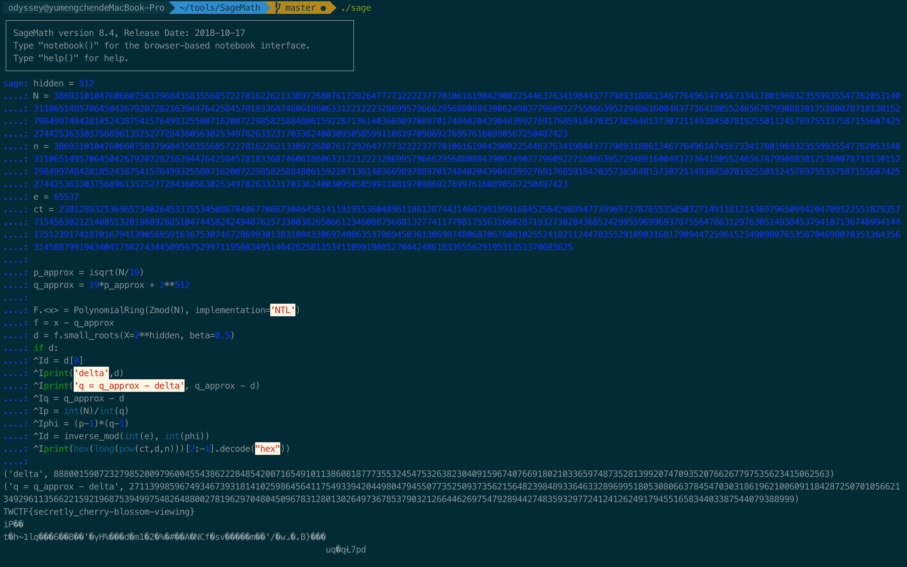

## Baby RSA

附件中包含三个文件，加密算法的源码（ruby），加密后的flag，公钥。

研究一下加密的源码，p和q都是随机生成的大素数，flag也被随机数填充。这是一个典型的RSA加密算法。

```ruby
p = rand(2**1024)
q = 19 * p + rand(2**512)

p = next_prime(p)
q = next_prime(q)

e = 65537
d = mod_inverse(e, (p - 1) * (q - 1))

n = (p.to_i * q.to_i)
```

所以，直接将得到的公钥中的N进行质因数分解可能无法实现。

```ruby
def check_prime(p, count = nil)
  return true if [2,3].include?(p)
  return false if p.even? || p < 2

  d, s = p - 1, 0
  d, s = d >> 1, s + 1 while d.even?

  count = [16, p.to_s(4).size].max unless count
  count.times do
    a = rand(2...(p - 1))
    return false if p.gcd(a) != 1
    if (x = mod_pow(a, d, p)) != 1
      return false unless (0...s).inject(false) do |res, r| 
        break true if(x == p - 1)
        x = x * x % p
        next false
      end
    end
  end
  return true
end

def next_prime(x)
  while !check_prime(x)
    x += 1
  end
  x
end
```
从这段代码中，我们可以假设$p=p+\Delta_1$，$q=19*p+\Delta_2$，则$N=(p+\Delta_1)\cdot(19*p+\Delta_2)$，其中$\Delta_2$应该为 $rand(2^{512})\plusmn x$，但是根据p的值，我们可知，$p = rand(2^{1024})$，远大于$\Delta_1$和$\Delta_2$的值，这意味着，$\Delta_1$和$\Delta_2$只能对N的低位产生影响，而高位是无法受到影响的，即$N$与$p\cdot 19\cdot p$的值在高位是相同的。且$N \geqq p\cdot 19\cdot p$

首先我们先计算出一个高位正确的p，`p_approx = gmpy2.iroot(N/19)`，且q具有一个上限，`q_approx = p_approx * 19 + 2**512`

在本地测试时，我们大概可以猜测出p的515-520个高位

让我们换一个角度再来观察一下，现在我们有值q_approx，我们希望恢复值$\Delta$，使得q = q_approx $-\Delta$（如果我们使用下限而不是上限，则为$+\Delta$）

如果我们在模N环中使单变量多项式使得F（x）= q_approx-x，那么很明显,$\Delta$ （delta）就是这个多项式的根，因为q是N的因子，所以$q\space mod\space N ==0$。

我们需要的根也不是那么大，因为它实际上是我们缺少的q的低位，所以最多$2^{512}$，小于N / 4。 根据[Coppersmith 攻击](https://ctf-wiki.github.io/ctf-wiki/crypto/asymmetric/rsa/rsa_coppersmith_attack/)知道我们可以有效地找到这种多项式的小根，所以我们继续使用sage代码：

```sage
p_approx = isqrt(N/19)
q_approx = 19*p_approx + 2**512

F.<x> = PolynomialRing(Zmod(N), implementation='NTL')
f = x - q_approx
d = f.small_roots(X=2**hidden, beta=0.5)
```
这里可以求出delta值并恢复出q。

```sage
hidden = 512
N = 386931010476066075837968435835568572278162262133897268076172926477773222237770106161904290022544637634198443777989318861346776496147456733417801969323559935547762053140311065149570645042679207282163944764258457818336874606186063312212223286995796662956880884390624903779609227558663952294861600483773641805524656787990883017538007871813015279849974842810524387541576499325580716200722985825884806159228713614036698970897017484020439048399276917685918470357385648137307211493845078192550112457897553375871556074252744253633037568961352527728436056302534978263323170336240030950585991108197098692769976160890567250487423
n = 386931010476066075837968435835568572278162262133897268076172926477773222237770106161904290022544637634198443777989318861346776496147456733417801969323559935547762053140311065149570645042679207282163944764258457818336874606186063312212223286995796662956880884390624903779609227558663952294861600483773641805524656787990883017538007871813015279849974842810524387541576499325580716200722985825884806159228713614036698970897017484020439048399276917685918470357385648137307211493845078192550112457897553375871556074252744253633037568961352527728436056302534978263323170336240030950585991108197098692769976160890567250487423
e = 65537
ct = 238128932536965734026453335534508678486770867304645614119195536048961186128744314667991999168452564298994773996973787655358503271491181214369796509942047091225518293577154563021214085132019889288510474458242494876257330038265066123460887568813277411779817556316602871932730284368524299559699693787556478631297630514938453794107136748994144175123917418701679413905695916367530746728699301383100433069740863537869450361306987480687067608102552418211244703552910903168179094472596152349098076535870469807035136435631458879919434041758274344589567529971195683495146426258135341109919085270442486183365562919531353370683625

p_approx = isqrt(N/19)
q_approx = 19*p_approx + 2**512

F.<x> = PolynomialRing(Zmod(N), implementation='NTL')
f = x - q_approx
d = f.small_roots(X=2**hidden, beta=0.5)
if d:
	d = d[0]
	print('delta',d)
	print('q = q_approx - delta', q_approx - d)
	q = q_approx - d
	p = int(N)/int(q)
	phi = (p-1)*(q-1)
	d = inverse_mod(int(e), int(phi))
	print(hex(long(pow(ct,d,n)))[2:-1].decode("hex"))

```


解出flag。