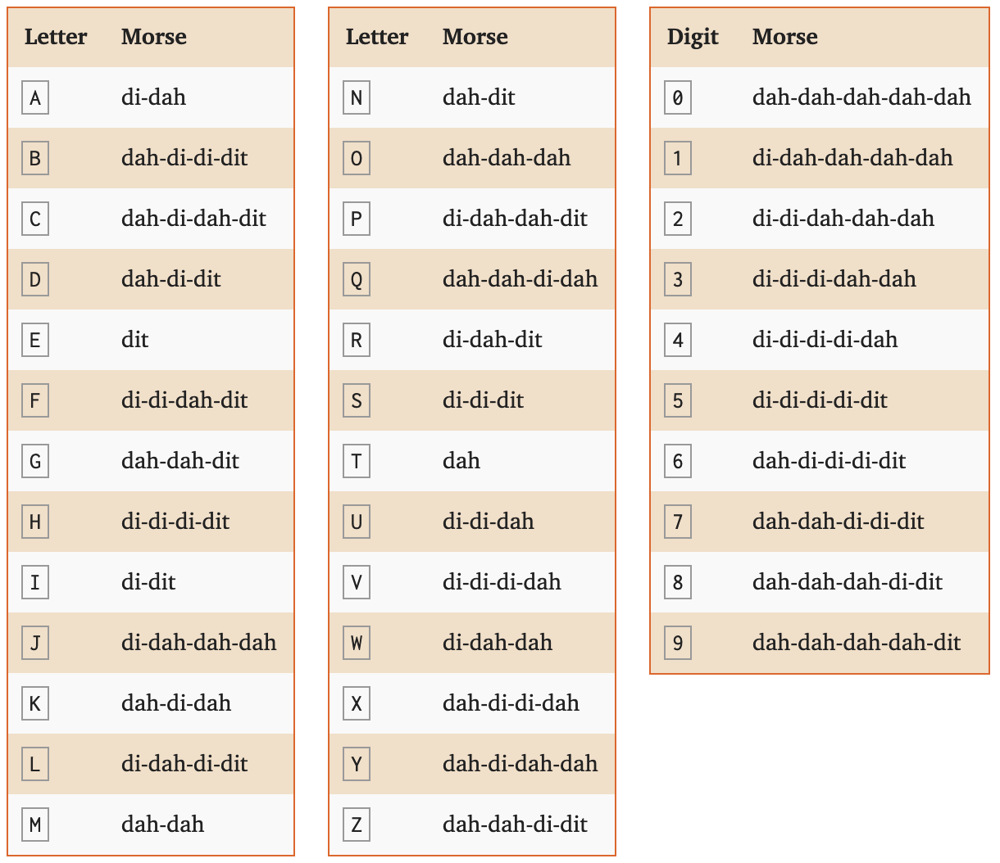
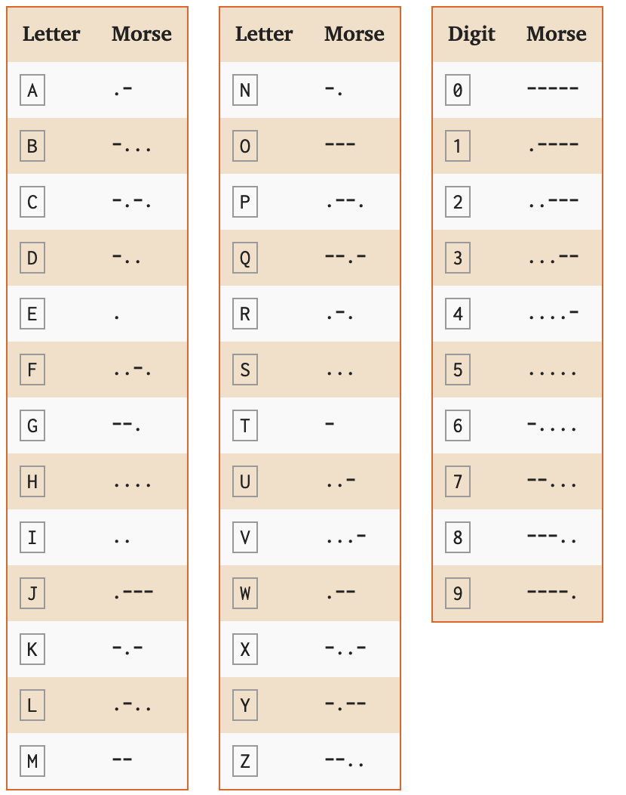

## -_-

这是第一道签到题，显而易见，这个是莫尔斯电码。但是作者用dah、di、dit来指代了。我们查看一下如下的对应表：





通过这两张图，我们可以看出，dah、di、dit分别指代了 - 、.、.

对flag文件中的字母进行替换，得到了标准的莫尔斯电码

```
----- -..- ..... --... --... ----- ..--- .- -.... -.-. ..... ---.. --... ....- ....- --... ..... .---- ...-- ---.. -.... ..... ...-- ---.. --... .---- -.... . -.... -.. ....- -.. ..... ----. ..... ..... ..--- .- --... ...-- --... -.... ....- -.... ....- ---.. -.... -... -.... .- ....- ----. --... ....- ..--- .- ..... ..--- ..... .---- ..--- -.... ....- .- --... ----- ..... .- --... -.... -.... .- -.... -.. ..--- .---- ..--- ..... ..--- ..... ....- -... ....- ....- -.... -... -.... -.... --... ----- ..--- ...-- ..... . ....- . ...-- ----. -.... -.... -.... -... ...-- ....- -.... ....- ..... ..... ...-- ....- -.... -.-. ....- ..--- ...-- ...-- --... ..--- ..... ....- -.... ..-. ..... ....- ...-- ----- ..... ----- ..... .- ..... .---- -.... -.. ....- ...-- ..... .---- ....- ..... ....- -... ..... ----. ....- ..--- ...-- ....- ..... .- ....- -.. --... -.... ..--- .- ..--- .---- ....- -.... -.... -... ...-- ---.. -.... -.-. ..--- ..... -.... ..--- -.... .- --... .---- -.... -.-. ..... ----- ....- -.. -.... -.... ....- ----. ....- --... -.... -.. -.... .---- ..--- ..... ..--- ..... ....- -.... --... .- ....- --... ..--- ----- -.... --... -.... ----. -.... --... -.... ..... -.... -.. --... -... ....- ...-- ...-- .---- -.... ----. -.... ...-- ....- -... ..... ..-. -.... ...-- -.... -.-. ...-- .---- ....- ...-- ....- -... ..--- -.. --... ----. ...-- ----- --... ..... ..... ..-. -.... ---.. ...-- ....- --... -.... ...-- ...-- ..... ..-. -.... -.. ...-- ....- ....- ----. ...-- .---- --... -.. ..--- ----- --... ..... --... -.... ...-- ....- --... -.... --... .- ....- -... ..... .- --... ....- ...-- ....- --... ----. -.... ..-. -.... -.. -.... ----. ....- ....- ..... ...-- -.... ---.. ....- -.-. -.... -.. ...-- ---.. ..... .---- ....- ..... ....- -.... -.... . ..... ..... --... ....- --... --... ....- .- ....- ----- ....- . --... ..... ....- ..-. ..... ----. -.... -.... ..... ---.. ..--- -.... ...-- ---.. --... ..... ....- ----- ....- --... -.... . ..--- .---- ...-- .---- ..--- ..... ..... ....- --... .---- --... -.... ...-- ----- ..... -.... -.... ...-- ..... ..--- --... .- ..... -.... ..--- .---- -.... .- ..--- .---- --... -.... --... ..... --... ..... --... ----- ...-- ---.. ....- ..--- -.... .- -.... ....- ....- . ....- ----. --... .---- ....- ..... ...-- ..... --... --... ..--- ...-- ..--- ....- ..--- ..... ..... -.... ...-- ....- ..... ..... ..... .- ....- ..-. ..... ----. ..... .- ...-- ..--- --... .- ...-- --... ..... ....- ...-- ..--- ...-- ..... --... ....- ...-- --... ..--- -.... --... ---.. ....- -.-. ....- ----- ..... --... ....- ..-. ...-- --... ...-- ....- ...-- .---- ...-- ----- ..... .---- ....- ----.
```
解密电码，得到如下字符：

```
0X57702A6C58744751386538716E6D4D59552A737646486B6A49742A5251264A705A766A6D2125254B446B6670235E4E39666B346455346C423372546F5430505A516D4351454B5942345A4D762A21466B386C25626A716C504D6649476D612525467A4720676967656D7B433169634B5F636C31434B2D7930755F683476335F6D3449317D20757634767A4B5A7434796F6D694453684C6D385145466E5574774A404E754F59665826387540476E213125547176305663527A56216A217675757038426A644E49714535772324255634555A4F595A327A37543235743726784C40574F373431305149
```
显而易见，这是一串16进制数。用python程序把它转换成ASCII码即可。

```python
import binascii

m = "57702A6C58744751386538716E6D4D59552A737646486B6A49742A5251264A705A766A6D2125254B446B6670235E4E39666B346455346C423372546F5430505A516D4351454B5942345A4D762A21466B386C25626A716C504D6649476D612525467A4720676967656D7B433169634B5F636C31434B2D7930755F683476335F6D3449317D20757634767A4B5A7434796F6D694453684C6D385145466E5574774A404E754F59665826387540476E213125547176305663527A56216A217675757038426A644E49714535772324255634555A4F595A327A37543235743726784C40574F373431305149"

print binascii.a2b_hex(m)
```

得到结果：
```
Wp*lXtGQ8e8qnmMYU*svFHkjIt*RQ&JpZvjm!%%KDkfp#^N9fk4dU4lB3rToT0PZQmCQEKYB4ZMv*!Fk8l%bjqlPMfIGma%%FzG gigem{C1icK_cl1CK-y0u_h4v3_m4I1} uv4vzKZt4yomiDShLm8QEFnUtwJ@NuOYfX&8u@Gn!1%Tqv0VcRzV!j!vuup8BjdNIqE5w#$%V4UZOYZ2z7T25t7&xL@WO7410QI
```

其中包含 `gigem{C1icK_cl1CK-y0u_h4v3_m4I1}` 为题目的解。