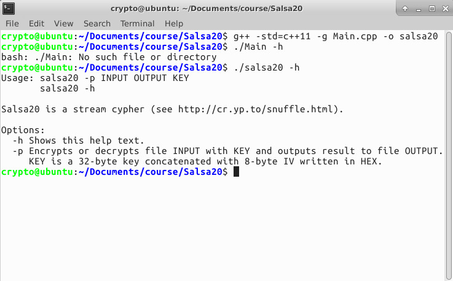

## C++实现Salsa20加密

### 【目的】
1. 用C++实现Salsa20加密
2. 标注函数的功能

### 【环境】
- 操作机：Ubuntu-crypto
- 密码：toor
- 参考代码存放位置：\Home\crypto\Documents\course

### 【工具】
- gcc

### 【原理】
Salsa20是一种流加密算法，由Daniel J. Bernstein提交到eSTREAM。它创建在基于add-rotate-xor（ARX）操作的伪随机函数之上——32位模加、异或（XOR）和循环移位操作。Salsa20映射一个256位密钥、一个64位nonce以及一个64位流位置到一个512位的输出（也存在一个128位密钥的版本）。这使Salsa20具有了不同寻常的优势，用户可以在恒定时间内寻求输出流中的任何位置。它可以在现代x86处理器中提供约每4–14次循环周期一字节的速度，并具有合理的硬件性能。它没有注册专利，并且Bernstein还撰写了几篇对常见架构优化的公有领域实现。Salsa20已被提交到eSTREAM。

结构

在其内部，该算法采用模加⊕（逻辑异或），32位模加$2^{32}$ ⊞，和在一个内部十六个32位word的state上进行恒定距离循环移位操作（<<<）。只使用add-rotate-xor操作避免了软件实现中计时攻击的可能性。基本的Salsa20循环函数 $R(a,b,c,k)$是
```
b ⊕= (a ⊞ c) <<< k;
```

初始状态是根据密钥的8个word、流位置的2个word、nonce的两个word（基本上是额外的流位置）和4个固定word制成。20轮循环混合制成16个word的流密码输出。

一个quarter-round会使用四个word的输入并制成四个word的输出。内部的16-word状态被布置为一个4x4矩阵；偶数循环应用quarter-round操作到四行的每项，奇数循环应用quarter-round操作到四列的每项。连续两轮循环（一次行循环和一次列循环）被称为double-round。

更精确的规范已在下方呈现为伪代码，尽管这种行/列模式更难看出⊞是模加232，<<<是左旋操作，及⊕是异或。x ⊕= y是x = x ⊕ y的缩写。

```
x[ 4] ⊕= (x[ 0] ⊞ x[12])<<<7;    x[ 9] ⊕= (x[ 5] ⊞ x[ 1])<<<7;
x[14] ⊕= (x[10] ⊞ x[ 6])<<<7;    x[ 3] ⊕= (x[15] ⊞ x[11])<<<7;
x[ 8] ⊕= (x[ 4] ⊞ x[ 0])<<<9;    x[13] ⊕= (x[ 9] ⊞ x[ 5])<<<9;
x[ 2] ⊕= (x[14] ⊞ x[10])<<<9;    x[ 7] ⊕= (x[ 3] ⊞ x[15])<<<9;
x[12] ⊕= (x[ 8] ⊞ x[ 4])<<<13;   x[ 1] ⊕= (x[13] ⊞ x[ 9])<<<13;
x[ 6] ⊕= (x[ 2] ⊞ x[14])<<<13;   x[11] ⊕= (x[ 7] ⊞ x[ 3])<<<13;
x[ 0] ⊕= (x[12] ⊞ x[ 8])<<<18;   x[ 5] ⊕= (x[ 1] ⊞ x[13])<<<18;
x[10] ⊕= (x[ 6] ⊞ x[ 2])<<<18;   x[15] ⊕= (x[11] ⊞ x[ 7])<<<18;

x[ 1] ⊕= (x[ 0] ⊞ x[ 3])<<<7;    x[ 6] ⊕= (x[ 5] ⊞ x[ 4])<<<7;
x[11] ⊕= (x[10] ⊞ x[ 9])<<<7;    x[12] ⊕= (x[15] ⊞ x[14])<<<7;
x[ 2] ⊕= (x[ 1] ⊞ x[ 0])<<<9;    x[ 7] ⊕= (x[ 6] ⊞ x[ 5])<<<9;
x[ 8] ⊕= (x[11] ⊞ x[10])<<<9;    x[13] ⊕= (x[12] ⊞ x[15])<<<9;
x[ 3] ⊕= (x[ 2] ⊞ x[ 1])<<<13;   x[ 4] ⊕= (x[ 7] ⊞ x[ 6])<<<13;
x[ 9] ⊕= (x[ 8] ⊞ x[11])<<<13;   x[14] ⊕= (x[13] ⊞ x[12])<<<13;
x[ 0] ⊕= (x[ 3] ⊞ x[ 2])<<<18;   x[ 5] ⊕= (x[ 4] ⊞ x[ 7])<<<18;
x[10] ⊕= (x[ 9] ⊞ x[ 8])<<<18;   x[15] ⊕= (x[14] ⊞ x[13])<<<18;
```
Salsa20在其输入上实行20轮混合，然后添加最终数组到原数数组来获得64字节输出块。但是，使用8轮和12轮的缩减循环的变体Salsa20/8和Salsa20/12也已分别被引入。这些变体被引入以补充原有的Salsa20，但不是取代它，甚至在eSTREAM的基准测量中比Salsa20表现更好[quantify]，尽管它相应有着较低的安全余量。

### 【实验步骤】

#### 参考代码 C++

Salsa20.h
```c++
#ifndef SALSA20_H
#define SALSA20_H

#include <cassert>
#include <climits>
#include <cstdint>
#include <cstring>

namespace ucstk
{

        using std::size_t;
        using std::int32_t;
        using std::uint8_t;
        using std::uint32_t;

        /**
         * Represents Salsa20 cypher. Supports only 256-bit keys.
         */
        class Salsa20
        {
        public:
                /// Helper constants
                enum: size_t
                {
                        VECTOR_SIZE = 16,
                        BLOCK_SIZE = 64,
                        KEY_SIZE = 32,
                        IV_SIZE = 8
                };

                /**
                 * \brief Constructs cypher with given key.
                 * \param[in] key 256-bit key
                 */
                inline Salsa20(const uint8_t* key = nullptr);
                Salsa20(const Salsa20&) = default;
                Salsa20(Salsa20&&) = default;
                ~Salsa20() = default;
                Salsa20& operator =(const Salsa20&) = default;
                Salsa20& operator =(Salsa20&&) = default;

                /**
                 * \brief Sets key.
                 * \param[in] key 256-bit key
                 */
                inline void setKey(const uint8_t* key);

                /**
                 * \brief Sets IV.
                 * \param[in] iv 64-bit IV
                 */
                inline void setIv(const uint8_t* iv);

                /**
                 * \brief Generates key stream.
                 * \param[out] output generated key stream
                 */
                inline void generateKeyStream(uint8_t output[BLOCK_SIZE]);

                /**
                 * \brief Processes blocks.
                 * \param[in] input input
                 * \param[out] output output
                 * \param[in] numBlocks number of blocks
                 */
                inline void processBlocks(const uint8_t* input, uint8_t* output, size_t numBlocks);

                /**
                 * \brief Processes bytes.
                 *
                 * This function should be used carefully. If number of bytes is not multiple of
                 * block size, then next call to the processBlocks function will be invalid.
                 * Normally this function should be used once at the end of encryption or
                 * decryption.
                 * \param[in] input input
                 * \param[out] output output
                 * \param[in] numBytes number of bytes
                 */
                inline void processBytes(const uint8_t* input, uint8_t* output, size_t numBytes);

        private:
                /**
                 * \brief Rotates value.
                 * \param[in] value value
                 * \param[in] numBits number of bits to rotate
                 * \return result of the rotation
                 */
                inline uint32_t rotate(uint32_t value, uint32_t numBits);

                /**
                 * \brief Converts 32-bit unsigned integer value to the array of bytes.
                 * \param[in] value 32-bit unsigned integer value
                 * \param[out] array array of bytes
                 */
                inline void convert(uint32_t value, uint8_t* array);

                /**
                 * \brief Converts array of bytes to the 32-bit unsigned integer value.
                 * \param[in] array array of bytes
                 * \return 32-bit unsigned integer value
                 */
                inline uint32_t convert(const uint8_t* array);

                // Data members
                uint32_t vector_[VECTOR_SIZE];

        };

}

#include "Salsa20.inl"
#endif
```

Salsa20.inl
```c++
#include "Salsa20.h"

namespace ucstk
{

        Salsa20::Salsa20(const uint8_t* key)
        {
                std::memset(vector_, 0, sizeof(vector_));
                setKey(key);
        }

        //----------------------------------------------------------------------------------
        void Salsa20::setKey(const uint8_t* key)
        {
                static const char constants[] = "expand 32-byte k";

                if(key == nullptr)
                        return;

                vector_[0] = convert(reinterpret_cast<const uint8_t*>(&constants[0]));
                vector_[1] = convert(&key[0]);
                vector_[2] = convert(&key[4]);
                vector_[3] = convert(&key[8]);
                vector_[4] = convert(&key[12]);
                vector_[5] = convert(reinterpret_cast<const uint8_t*>(&constants[4]));

                std::memset(&vector_[6], 0, 4 * sizeof(uint32_t));

                vector_[10] = convert(reinterpret_cast<const uint8_t*>(&constants[8]));
                vector_[11] = convert(&key[16]);
                vector_[12] = convert(&key[20]);
                vector_[13] = convert(&key[24]);
                vector_[14] = convert(&key[28]);
                vector_[15] = convert(reinterpret_cast<const uint8_t*>(&constants[12]));
        }

        //----------------------------------------------------------------------------------
        void Salsa20::setIv(const uint8_t* iv)
        {
                if(iv == nullptr)
                        return;

                vector_[6] = convert(&iv[0]);
                vector_[7] = convert(&iv[4]);
                vector_[8] = vector_[9] = 0;
        }

        //----------------------------------------------------------------------------------
        void Salsa20::generateKeyStream(uint8_t output[BLOCK_SIZE])
        {
                uint32_t x[VECTOR_SIZE];
                std::memcpy(x, vector_, sizeof(vector_));

                for(int32_t i = 20; i > 0; i -= 2)
                {
                        x[4 ] ^= rotate(static_cast<uint32_t>(x[0 ] + x[12]),  7);
                        x[8 ] ^= rotate(static_cast<uint32_t>(x[4 ] + x[0 ]),  9);
                        x[12] ^= rotate(static_cast<uint32_t>(x[8 ] + x[4 ]), 13);
                        x[0 ] ^= rotate(static_cast<uint32_t>(x[12] + x[8 ]), 18);
                        x[9 ] ^= rotate(static_cast<uint32_t>(x[5 ] + x[1 ]),  7);
                        x[13] ^= rotate(static_cast<uint32_t>(x[9 ] + x[5 ]),  9);
                        x[1 ] ^= rotate(static_cast<uint32_t>(x[13] + x[9 ]), 13);
                        x[5 ] ^= rotate(static_cast<uint32_t>(x[1 ] + x[13]), 18);
                        x[14] ^= rotate(static_cast<uint32_t>(x[10] + x[6 ]),  7);
                        x[2 ] ^= rotate(static_cast<uint32_t>(x[14] + x[10]),  9);
                        x[6 ] ^= rotate(static_cast<uint32_t>(x[2 ] + x[14]), 13);
                        x[10] ^= rotate(static_cast<uint32_t>(x[6 ] + x[2 ]), 18);
                        x[3 ] ^= rotate(static_cast<uint32_t>(x[15] + x[11]),  7);
                        x[7 ] ^= rotate(static_cast<uint32_t>(x[3 ] + x[15]),  9);
                        x[11] ^= rotate(static_cast<uint32_t>(x[7 ] + x[3 ]), 13);
                        x[15] ^= rotate(static_cast<uint32_t>(x[11] + x[7 ]), 18);
                        x[1 ] ^= rotate(static_cast<uint32_t>(x[0 ] + x[3 ]),  7);
                        x[2 ] ^= rotate(static_cast<uint32_t>(x[1 ] + x[0 ]),  9);
                        x[3 ] ^= rotate(static_cast<uint32_t>(x[2 ] + x[1 ]), 13);
                        x[0 ] ^= rotate(static_cast<uint32_t>(x[3 ] + x[2 ]), 18);
                        x[6 ] ^= rotate(static_cast<uint32_t>(x[5 ] + x[4 ]),  7);
                        x[7 ] ^= rotate(static_cast<uint32_t>(x[6 ] + x[5 ]),  9);
                        x[4 ] ^= rotate(static_cast<uint32_t>(x[7 ] + x[6 ]), 13);
                        x[5 ] ^= rotate(static_cast<uint32_t>(x[4 ] + x[7 ]), 18);
                        x[11] ^= rotate(static_cast<uint32_t>(x[10] + x[9 ]),  7);
                        x[8 ] ^= rotate(static_cast<uint32_t>(x[11] + x[10]),  9);
                        x[9 ] ^= rotate(static_cast<uint32_t>(x[8 ] + x[11]), 13);
                        x[10] ^= rotate(static_cast<uint32_t>(x[9 ] + x[8 ]), 18);
                        x[12] ^= rotate(static_cast<uint32_t>(x[15] + x[14]),  7);
                        x[13] ^= rotate(static_cast<uint32_t>(x[12] + x[15]),  9);
                        x[14] ^= rotate(static_cast<uint32_t>(x[13] + x[12]), 13);
                        x[15] ^= rotate(static_cast<uint32_t>(x[14] + x[13]), 18);
                }

                for(size_t i = 0; i < VECTOR_SIZE; ++i)
                {
                        x[i] += vector_[i];
                        convert(x[i], &output[4 * i]);
                }

                ++vector_[8];
                vector_[9] += vector_[8] == 0 ? 1 : 0;
        }

        //----------------------------------------------------------------------------------
        void Salsa20::processBlocks(const uint8_t* input, uint8_t* output, size_t numBlocks)
        {
                assert(input != nullptr && output != nullptr);

                uint8_t keyStream[BLOCK_SIZE];

                for(size_t i = 0; i < numBlocks; ++i)
                {
                        generateKeyStream(keyStream);

                        for(size_t j = 0; j < BLOCK_SIZE; ++j)
                                *(output++) = keyStream[j] ^ *(input++);
                }
        }

        //----------------------------------------------------------------------------------
        void Salsa20::processBytes(const uint8_t* input, uint8_t* output, size_t numBytes)
        {
                assert(input != nullptr && output != nullptr);

                uint8_t keyStream[BLOCK_SIZE];
                size_t numBytesToProcess;

                while(numBytes != 0)
                {
                        generateKeyStream(keyStream);
                        numBytesToProcess = numBytes >= BLOCK_SIZE ? BLOCK_SIZE : numBytes;

                        for(size_t i = 0; i < numBytesToProcess; ++i, --numBytes)
                                *(output++) = keyStream[i] ^ *(input++);
                }
        }

        //----------------------------------------------------------------------------------
        uint32_t Salsa20::rotate(uint32_t value, uint32_t numBits)
        {
                return (value << numBits) | (value >> (32 - numBits));
        }

        //----------------------------------------------------------------------------------
        void Salsa20::convert(uint32_t value, uint8_t* array)
        {
                array[0] = static_cast<uint8_t>(value >> 0);
                array[1] = static_cast<uint8_t>(value >> 8);
                array[2] = static_cast<uint8_t>(value >> 16);
                array[3] = static_cast<uint8_t>(value >> 24);
        }

        //----------------------------------------------------------------------------------
        uint32_t Salsa20::convert(const uint8_t* array)
        {
                return ((static_cast<uint32_t>(array[0]) << 0)  |
                        (static_cast<uint32_t>(array[1]) << 8)  |
                        (static_cast<uint32_t>(array[2]) << 16) |
                        (static_cast<uint32_t>(array[3]) << 24));
        }

}
```

Main.cpp
```c++
#include "Salsa20.h"

#include <iostream>
#include <cstdlib>
#include <fstream>
#include <string>

using namespace ucstk;

/**
 * Represents program.
 */
class Program
{
public:
        Program(): inputFileName_(), outputFileName_(), shouldShowHelp_(false)
        {
                std::memset(key_, 0, sizeof(key_));
        }
        Program(const Program&) = delete;
        Program(Program&&) = delete;
        ~Program() {}
        Program& operator =(const Program&) = delete;
        Program& operator =(Program&&) = delete;

        /**
         * \brief Reads parameters from command line and validates them.
         * \param[in] argc number of command line arguments passed
         * \param[in] argv array of command line arguments
         * \return true on success
         */
        bool initialize(int argc, char* argv[])
        {
                std::string key;
                shouldShowHelp_ = false;

                for(int i = 0; i < argc; ++i)
                {
                        std::string parameter = argv[i];

                        if(parameter == "-p")
                        {
                                if((argc - i - 1) != 3)
                                        break;

                                inputFileName_ = argv[++i];
                                outputFileName_ = argv[++i];
                                key = argv[++i];
                                break;
                        }

                        if(parameter == "-h")
                        {
                                shouldShowHelp_ = true;
                                return true;
                        }
                }

                if(inputFileName_.empty())
                {
                        std::cout << "E: Input file name was not specified." << std::endl;
                        return false;
                }

                if(outputFileName_.empty())
                {
                        std::cout << "E: Output file name was not specified." << std::endl;
                        return false;
                }

                if(inputFileName_ == outputFileName_)
                {
                        std::cout << "E: Input and output files should be distinct." << std::endl;
                        return false;
                }

                if(key.empty())
                {
                        std::cout << "E: Key was not specified." << std::endl;
                        return false;
                }

                if(!readKeyFromString(key))
                {
                        std::cout << "E: Invalid key value." << std::endl;
                        return false;
                }

                return true;
        }

        /**
         * \brief Encrypts or decrypts the file.
         * \return true on success
         */
        bool execute()
        {
                if(shouldShowHelp_)
                {
                        std::cout << "Usage: salsa20 -p INPUT OUTPUT KEY" << std::endl;
                        std::cout << "       salsa20 -h" << std::endl;
                        std::cout << std::endl << "Salsa20 is a stream cypher (see http://cr.yp.to/snuffle.html).";
                        std::cout << std::endl << std::endl;
                        std::cout << "Options:" << std::endl;
                        std::cout << "  -h Shows this help text." << std::endl;
                        std::cout << "  -p Encrypts or decrypts file INPUT with KEY and outputs result to file OUTPUT.";
                        std::cout << std::endl;
                        std::cout << "     KEY is a 32-byte key concatenated with 8-byte IV written in HEX.";
                        std::cout << std::endl;
                        return true;
                }

                std::ifstream inputStream(inputFileName_, std::ios_base::binary);
                if(!inputStream)
                {
                        std::cout << "E: Could not open input file." << std::endl;
                        return false;
                }

                std::ofstream outputStream(outputFileName_, std::ios_base::binary);
                if(!outputStream)
                {
                        std::cout << "E: Could not create output file." << std::endl;
                        return false;
                }

                const auto chunkSize = NUM_OF_BLOCKS_PER_CHUNK * Salsa20::BLOCK_SIZE;
                uint8_t chunk[chunkSize];

                // determine size of the file
                inputStream.seekg(0, std::ios_base::end);
                auto fileSize = inputStream.tellg();
                inputStream.seekg(0, std::ios_base::beg);

                // compute number of chunks and size of the remainder
                auto numChunks = fileSize / chunkSize;
                auto remainderSize = fileSize % chunkSize;

                // process file
                Salsa20 salsa20(key_);
                salsa20.setIv(&key_[IV_OFFSET]);
                std::cout << "Processing file \"" << inputFileName_ << '"' << std::endl;

                for(decltype(numChunks) i = 0; i < numChunks; ++i)
                {
                        inputStream.read(reinterpret_cast<char*>(chunk), sizeof(chunk));
                        salsa20.processBlocks(chunk, chunk, NUM_OF_BLOCKS_PER_CHUNK);
                        outputStream.write(reinterpret_cast<const char*>(chunk), sizeof(chunk));

                        float percentage = 100.0f * static_cast<float>(i + 1) / static_cast<float>(numChunks);
                        std::printf("[%3.2f]\r", percentage);
                }

                if(remainderSize != 0)
                {
                        inputStream.read(reinterpret_cast<char*>(chunk), remainderSize);
                        salsa20.processBytes(chunk, chunk, remainderSize);
                        outputStream.write(reinterpret_cast<const char*>(chunk), remainderSize);
                        std::cout << "[100.00]";
                }

                std::cout << std::endl << "OK" << std::endl;
                return true;
        }

private:
        /// Helper constants
        enum: size_t
        {
                NUM_OF_BLOCKS_PER_CHUNK = 8192,
                IV_OFFSET = Salsa20::KEY_SIZE,
                KEY_SIZE  = Salsa20::KEY_SIZE + Salsa20::IV_SIZE
        };

        /**
         * \brief Reads byte from string.
         * \param[in] string string
         * \param[out] byte byte
         * \return true on success
         */
        bool readByte(const char* string, uint8_t& byte)
        {
                byte = 0;

                for(uint32_t i = 0; i < 2; ++i)
                {
                        uint8_t value = 0;
                        char c = string[i];

                        if(c >= '0' && c <= '9')
                                value = c - '0';
                        else if(c >= 'A' && c <= 'F')
                                value = c - 'A' + 0x0A;
                        else if(c >= 'a' && c <= 'f')
                                value = c - 'a' + 0x0A;
                        else
                                return false;

                        byte |= (value << (4 - i * 4));
                }

                return true;
        }

        /**
         * \brief Reads key from string.
         * \param[in] string string
         * \return true on success
         */
        bool readKeyFromString(const std::string& string)
        {
                auto stringLength = string.length();

                if(stringLength != 2 * KEY_SIZE)
                        return false;

                for(decltype(stringLength) i = 0; i < stringLength; i += 2)
                {
                        if(!readByte(&string[i], key_[i / 2]))
                                return false;
                }

                return true;
        }

        // Data members
        std::string inputFileName_, outputFileName_;
        uint8_t key_[KEY_SIZE];
        bool shouldShowHelp_;

};

// Entry point
int main(int argc, char* argv[])
{
        Program program;

        if(!program.initialize(argc, argv))
                return 1;

        if(!program.execute())
                return 2;

        return 0;
}
```

1. 新建一个头文件、inl文件和C++文件，拷贝代码到文件中


2. 进入文件所在文件夹，打开terminal，编译c++文件
`g++ -std=c++11 -g Main.cpp -o salsa20`
注意，此处一定要添加`-std=c++11`选项，如果不添加，会报出如下错误
`This support is currently experimental, and must be enabled with the -std=c++11 or -std=gnu++11 compiler options`

3. 观察代码第52至56行和第98行至111行，程序编写了一个`help`的帮助选项，我们可以在执行程序时使用 `-h`选项
运行 `./salsa20 -h`


4. 根据提示。我们可以自定义一个key,此处程序定义了key是一段32bit的16进制数，加上8bit的IV

### 【总结】

- 通过本节实验，了解到了Salsa20算法的加密过程。同时要注意到，绝对不能使用同样的密钥和初始向量加密不同的明文，这样会导致密文容易破解。