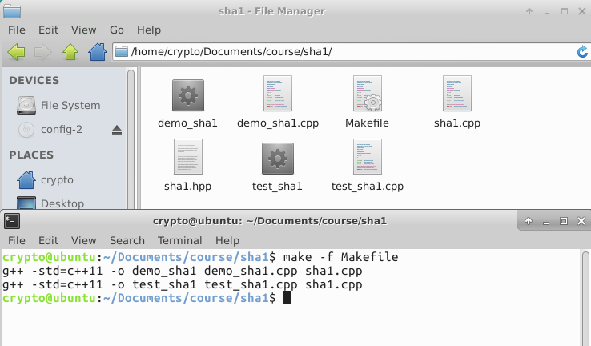

## C++实现SHA-1算法

### 【目的】
1. 实现SHA-1加解密
2. 标注函数对应的算法

### 【环境】
- 操作机：Ubuntu-crypto
- 密码：toor
- 参考代码存放位置：\Home\crypto\Documents\course

### 【工具】
- g++ 
- make工具

### 【原理】
SHA-1（英语：Secure Hash Algorithm 1，中文名：安全散列算法1）是一种密码散列函数，美国国家安全局设计，并由美国国家标准技术研究所（NIST）发布为联邦数据处理标准（FIPS）[2]。SHA-1可以生成一个被称为消息摘要的160位（20字节）散列值，散列值通常的呈现形式为40个十六进制数。

SHA-1已经不再视为可抵御有充足资金、充足计算资源的攻击者。2005年，密码分析人员发现了对SHA-1的有效攻击方法，这表明该算法可能不够安全，不能继续使用[3]，自2010年以来，许多组织建议用SHA-2或SHA-3来替换SHA-1。Microsoft[7]、Google以及Mozilla都宣布，它们旗下的浏览器将在2017年前停止接受使用SHA-1算法签名的SSL证书。

2017年2月23日，CWI Amsterdam与Google宣布了一个成功的SHA-1碰撞攻击，发布了两份内容不同但SHA-1散列值相同的PDF文件作为概念证明。

SHA-1算法

以下是SHA-1算法的伪代码：

```
İniyorlar variables:
h0 := 0x67452301
h1 := 0xEFCDAB89
h2 := 0x98BADCFE
h3 := 0x10325476
h4 := 0xC3D2E1F0
```

```
Pre-processing:
append the bit '1' to the message
append k bits '0', where k is the minimum number >= 0 such that the resulting message
    length (in bits) is congruent to 448(mod 512)
append length of message (before pre-processing), in bits, as 64-bit big-endian integer
```

```
Process the message in successive 512-bit chunks:
break message into 512-bit chunks
for each chunk
    break chunk into sixteen 32-bit big-endian words w[i], 0 ≤ i ≤ 15
```

```
    Extend the sixteen 32-bit words into eighty 32-bit words:
    for i from 16 to 79
        w[i] := (w[i-3] xor w[i-8] xor w[i-14] xor w[i-16]) leftrotate 1
```

```
nitialize hash value for this chunk:
    a := h0
    b := h1
    c := h2
    d := h3
    e := h4
```

```
Main loop:
    for i from 0 to 79
        if 0 ≤ i ≤ 19 then
            f := (b and c) or ((not b) and d)
            k := 0x5A827999
        else if 20 ≤ i ≤ 39
            f := b xor c xor d
            k := 0x6ED9EBA1
        else if 40 ≤ i ≤ 59
            f := (b and c) or (b and d) or(c and d)
            k := 0x8F1BBCDC
        else if 60 ≤ i ≤ 79
            f := b xor c xor d
            k := 0xCA62C1D6
```

```
 temp := (a leftrotate 5) + f + e + k + w[i]
        e := d
        d := c
        c := b leftrotate 30
        b := a
        a := temp
```

```
 Add this chunk's hash to result so far:
    h0 := h0 + a
    h1 := h1 + b
    h2 := h2 + c
    h3 := h3 + d
    h4 := h4 + e
```

```
Produce the final hash value (big-endian):
digest = hash = h0 append h1 append h2 append h3 append h4
```
上述关于f表达式列于FIPS PUB 180-1中，以下替代表达式也许也能在主要循环里计算f：
```
(0  ≤ i ≤ 19): f := d xor (b and (c xor d))         (alternative)
 
(40 ≤ i ≤ 59): f := (b and c) or (d and (b or c))   (alternative 1)
(40 ≤ i ≤ 59): f := (b and c) or (d and (b xor c))  (alternative 2)
(40 ≤ i ≤ 59): f := (b and c) + (d and (b xor c))   (alternative 3)
```


### 【实验步骤】

#### 参考代码 C++

sha1.cpp
```c++
#include "sha1.hpp"
#include <sstream>
#include <iomanip>
#include <fstream>


static const size_t BLOCK_INTS = 16;  /* number of 32bit integers per SHA1 block */
static const size_t BLOCK_BYTES = BLOCK_INTS * 4;


static void reset(uint32_t digest[], std::string &buffer, uint64_t &transforms)
{
    /* SHA1 initialization constants */
    digest[0] = 0x67452301;
    digest[1] = 0xefcdab89;
    digest[2] = 0x98badcfe;
    digest[3] = 0x10325476;
    digest[4] = 0xc3d2e1f0;

    /* Reset counters */
    buffer = "";
    transforms = 0;
}


static uint32_t rol(const uint32_t value, const size_t bits)
{
    return (value << bits) | (value >> (32 - bits));
}


static uint32_t blk(const uint32_t block[BLOCK_INTS], const size_t i)
{
    return rol(block[(i+13)&15] ^ block[(i+8)&15] ^ block[(i+2)&15] ^ block[i], 1);
}


/*
 * (R0+R1), R2, R3, R4 are the different operations used in SHA1
 */

static void R0(const uint32_t block[BLOCK_INTS], const uint32_t v, uint32_t &w, const uint32_t x, const uint32_t y, uint32_t &z, const size_t i)
{
    z += ((w&(x^y))^y) + block[i] + 0x5a827999 + rol(v, 5);
    w = rol(w, 30);
}


static void R1(uint32_t block[BLOCK_INTS], const uint32_t v, uint32_t &w, const uint32_t x, const uint32_t y, uint32_t &z, const size_t i)
{
    block[i] = blk(block, i);
    z += ((w&(x^y))^y) + block[i] + 0x5a827999 + rol(v, 5);
    w = rol(w, 30);
}


static void R2(uint32_t block[BLOCK_INTS], const uint32_t v, uint32_t &w, const uint32_t x, const uint32_t y, uint32_t &z, const size_t i)
{
    block[i] = blk(block, i);
    z += (w^x^y) + block[i] + 0x6ed9eba1 + rol(v, 5);
    w = rol(w, 30);
}


static void R3(uint32_t block[BLOCK_INTS], const uint32_t v, uint32_t &w, const uint32_t x, const uint32_t y, uint32_t &z, const size_t i)
{
    block[i] = blk(block, i);
    z += (((w|x)&y)|(w&x)) + block[i] + 0x8f1bbcdc + rol(v, 5);
    w = rol(w, 30);
}


static void R4(uint32_t block[BLOCK_INTS], const uint32_t v, uint32_t &w, const uint32_t x, const uint32_t y, uint32_t &z, const size_t i)
{
    block[i] = blk(block, i);
    z += (w^x^y) + block[i] + 0xca62c1d6 + rol(v, 5);
    w = rol(w, 30);
}


/*
 * Hash a single 512-bit block. This is the core of the algorithm.
 */

static void transform(uint32_t digest[], uint32_t block[BLOCK_INTS], uint64_t &transforms)
{
    /* Copy digest[] to working vars */
    uint32_t a = digest[0];
    uint32_t b = digest[1];
    uint32_t c = digest[2];
    uint32_t d = digest[3];
    uint32_t e = digest[4];

    /* 4 rounds of 20 operations each. Loop unrolled. */
    R0(block, a, b, c, d, e,  0);
    R0(block, e, a, b, c, d,  1);
    R0(block, d, e, a, b, c,  2);
    R0(block, c, d, e, a, b,  3);
    R0(block, b, c, d, e, a,  4);
    R0(block, a, b, c, d, e,  5);
    R0(block, e, a, b, c, d,  6);
    R0(block, d, e, a, b, c,  7);
    R0(block, c, d, e, a, b,  8);
    R0(block, b, c, d, e, a,  9);
    R0(block, a, b, c, d, e, 10);
    R0(block, e, a, b, c, d, 11);
    R0(block, d, e, a, b, c, 12);
    R0(block, c, d, e, a, b, 13);
    R0(block, b, c, d, e, a, 14);
    R0(block, a, b, c, d, e, 15);
    R1(block, e, a, b, c, d,  0);
    R1(block, d, e, a, b, c,  1);
    R1(block, c, d, e, a, b,  2);
    R1(block, b, c, d, e, a,  3);
    R2(block, a, b, c, d, e,  4);
    R2(block, e, a, b, c, d,  5);
    R2(block, d, e, a, b, c,  6);
    R2(block, c, d, e, a, b,  7);
    R2(block, b, c, d, e, a,  8);
    R2(block, a, b, c, d, e,  9);
    R2(block, e, a, b, c, d, 10);
    R2(block, d, e, a, b, c, 11);
    R2(block, c, d, e, a, b, 12);
    R2(block, b, c, d, e, a, 13);
    R2(block, a, b, c, d, e, 14);
    R2(block, e, a, b, c, d, 15);
    R2(block, d, e, a, b, c,  0);
    R2(block, c, d, e, a, b,  1);
    R2(block, b, c, d, e, a,  2);
    R2(block, a, b, c, d, e,  3);
    R2(block, e, a, b, c, d,  4);
    R2(block, d, e, a, b, c,  5);
    R2(block, c, d, e, a, b,  6);
    R2(block, b, c, d, e, a,  7);
    R3(block, a, b, c, d, e,  8);
    R3(block, e, a, b, c, d,  9);
    R3(block, d, e, a, b, c, 10);
    R3(block, c, d, e, a, b, 11);
    R3(block, b, c, d, e, a, 12);
    R3(block, a, b, c, d, e, 13);
    R3(block, e, a, b, c, d, 14);
    R3(block, d, e, a, b, c, 15);
    R3(block, c, d, e, a, b,  0);
    R3(block, b, c, d, e, a,  1);
    R3(block, a, b, c, d, e,  2);
    R3(block, e, a, b, c, d,  3);
    R3(block, d, e, a, b, c,  4);
    R3(block, c, d, e, a, b,  5);
    R3(block, b, c, d, e, a,  6);
    R3(block, a, b, c, d, e,  7);
    R3(block, e, a, b, c, d,  8);
    R3(block, d, e, a, b, c,  9);
    R3(block, c, d, e, a, b, 10);
    R3(block, b, c, d, e, a, 11);
    R4(block, a, b, c, d, e, 12);
    R4(block, e, a, b, c, d, 13);
    R4(block, d, e, a, b, c, 14);
    R4(block, c, d, e, a, b, 15);
    R4(block, b, c, d, e, a,  0);
    R4(block, a, b, c, d, e,  1);
    R4(block, e, a, b, c, d,  2);
    R4(block, d, e, a, b, c,  3);
    R4(block, c, d, e, a, b,  4);
    R4(block, b, c, d, e, a,  5);
    R4(block, a, b, c, d, e,  6);
    R4(block, e, a, b, c, d,  7);
    R4(block, d, e, a, b, c,  8);
    R4(block, c, d, e, a, b,  9);
    R4(block, b, c, d, e, a, 10);
    R4(block, a, b, c, d, e, 11);
    R4(block, e, a, b, c, d, 12);
    R4(block, d, e, a, b, c, 13);
    R4(block, c, d, e, a, b, 14);
    R4(block, b, c, d, e, a, 15);

    /* Add the working vars back into digest[] */
    digest[0] += a;
    digest[1] += b;
    digest[2] += c;
    digest[3] += d;
    digest[4] += e;

    /* Count the number of transformations */
    transforms++;
}


static void buffer_to_block(const std::string &buffer, uint32_t block[BLOCK_INTS])
{
    /* Convert the std::string (byte buffer) to a uint32_t array (MSB) */
    for (size_t i = 0; i < BLOCK_INTS; i++)
    {
        block[i] = (buffer[4*i+3] & 0xff)
                   | (buffer[4*i+2] & 0xff)<<8
                   | (buffer[4*i+1] & 0xff)<<16
                   | (buffer[4*i+0] & 0xff)<<24;
    }
}


SHA1::SHA1()
{
    reset(digest, buffer, transforms);
}


void SHA1::update(const std::string &s)
{
    std::istringstream is(s);
    update(is);
}


void SHA1::update(std::istream &is)
{
    while (true)
    {
        char sbuf[BLOCK_BYTES];
        is.read(sbuf, BLOCK_BYTES - buffer.size());
        buffer.append(sbuf, is.gcount());
        if (buffer.size() != BLOCK_BYTES)
        {
            return;
        }
        uint32_t block[BLOCK_INTS];
        buffer_to_block(buffer, block);
        transform(digest, block, transforms);
        buffer.clear();
    }
}


/*
 * Add padding and return the message digest.
 */

std::string SHA1::final()
{
    /* Total number of hashed bits */
    uint64_t total_bits = (transforms*BLOCK_BYTES + buffer.size()) * 8;

    /* Padding */
    buffer += 0x80;
    size_t orig_size = buffer.size();
    while (buffer.size() < BLOCK_BYTES)
    {
        buffer += (char)0x00;
    }

    uint32_t block[BLOCK_INTS];
    buffer_to_block(buffer, block);

    if (orig_size > BLOCK_BYTES - 8)
    {
        transform(digest, block, transforms);
        for (size_t i = 0; i < BLOCK_INTS - 2; i++)
        {
            block[i] = 0;
        }
    }

    /* Append total_bits, split this uint64_t into two uint32_t */
    block[BLOCK_INTS - 1] = total_bits;
    block[BLOCK_INTS - 2] = (total_bits >> 32);
    transform(digest, block, transforms);

    /* Hex std::string */
    std::ostringstream result;
    for (size_t i = 0; i < sizeof(digest) / sizeof(digest[0]); i++)
    {
        result << std::hex << std::setfill('0') << std::setw(8);
        result << digest[i];
    }

    /* Reset for next run */
    reset(digest, buffer, transforms);

    return result.str();
}


std::string SHA1::from_file(const std::string &filename)
{
    std::ifstream stream(filename.c_str(), std::ios::binary);
    SHA1 checksum;
    checksum.update(stream);
    return checksum.final();
}
```

**sha1.hpp**
```c++
#ifndef SHA1_HPP
#define SHA1_HPP


#include <cstdint>
#include <iostream>
#include <string>


class SHA1
{
public:
    SHA1();
    void update(const std::string &s);
    void update(std::istream &is);
    std::string final();
    static std::string from_file(const std::string &filename);

private:
    uint32_t digest[5];
    std::string buffer;
    uint64_t transforms;
};


#endif /* SHA1_HPP */
```

**demo_sha1.cpp**
```c++
#include "sha1.hpp"
#include <string>
#include <iostream>
using std::string;
using std::cout;
using std::endl;

int main(int argc, const char *argv[])
{
    const string input = "abc";

    SHA1 checksum;
    checksum.update(input);
    const string hash = checksum.final();

    cout << "The SHA-1 of \"" << input << "\" is: " << hash << endl;

    return 0;
}
```

**test_sha1.cpp**
```c++
#include "sha1.hpp"
#include <string>
#include <iostream>
using std::string;
using std::cout;
using std::endl;


void compare(const string &result, const string &expected)
{
    const string &state = (result == expected) ? "OK" : "Failure";
    cout << "Result:   " << result << endl;
    cout << "Expected: " << expected << "  (" << state << ")" << endl;
}


/*
 * The 3 test vectors from FIPS PUB 180-1
 */

void test_standard()
{
    SHA1 checksum;

    cout << endl;
    cout << "Test:     abc" << endl;
    checksum.update("abc");
    compare(checksum.final(), "a9993e364706816aba3e25717850c26c9cd0d89d");

    cout << endl;
    cout << "Test:     abcdbcdecdefdefgefghfghighijhijkijkljklmklmnlmnomnopnopq" << endl;
    checksum.update("abcdbcdecdefdefgefghfghighijhijkijkljklmklmnlmnomnopnopq");
    compare(checksum.final(), "84983e441c3bd26ebaae4aa1f95129e5e54670f1");

    cout << endl;
    cout << "Test:     A million repetitions of 'a'" << endl;
    for (int i = 0; i < 1000000/200; ++i)
    {
        checksum.update("aaaaaaaaaaaaaaaaaaaaaaaaaaaaaaaaaaaaaaaaaaaaaaaaaa"
                        "aaaaaaaaaaaaaaaaaaaaaaaaaaaaaaaaaaaaaaaaaaaaaaaaaa"
                        "aaaaaaaaaaaaaaaaaaaaaaaaaaaaaaaaaaaaaaaaaaaaaaaaaa"
                        "aaaaaaaaaaaaaaaaaaaaaaaaaaaaaaaaaaaaaaaaaaaaaaaaaa"
                       );
    }
    compare(checksum.final(), "34aa973cd4c4daa4f61eeb2bdbad27316534016f");
}


/*
 * Other tests
 */

void test_other()
{
    SHA1 checksum;

    cout << endl;
    cout << "Test:     No string" << endl;
    compare(checksum.final(), "da39a3ee5e6b4b0d3255bfef95601890afd80709");

    cout << endl;
    checksum.update("");
    cout << "Test:     Empty string" << endl;
    compare(checksum.final(), "da39a3ee5e6b4b0d3255bfef95601890afd80709");

    cout << endl;
    cout << "Test:     abcde" << endl;
    checksum.update("abcde");
    compare(checksum.final(), "03de6c570bfe24bfc328ccd7ca46b76eadaf4334");

    cout << endl;
    cout << "Test:     Two concurrent checksum calculations" << endl;
    SHA1 checksum1, checksum2;
    checksum1.update("abc");
    compare(checksum2.final(), "da39a3ee5e6b4b0d3255bfef95601890afd80709"); /* "" */
    compare(checksum1.final(), "a9993e364706816aba3e25717850c26c9cd0d89d"); /* "abc" */
}


/*
 * immitate "sha1sum -b"
 */

void test_file(const string &filename)
{
    cout << SHA1::from_file(filename) << " *" << filename << endl;
}


/*
 * main
 */

int main(int argc, const char *argv[])
{
    if (argc > 1)
    {
        for (int i = 1; i < argc; i++)
        {
            test_file(argv[i]);
        }
    }
    else
    {
        test_standard();
        test_other();
        cout << endl;
        cout << endl;
    }

    return 0;
}

```

1. 分别创建`sha1.cpp`、`sha.hpp`、`demo_sha1.cpp`、`test_sha1.cpp`文件，将参考代码粘贴到文件中

2. 因为文件比较多，所以我们使用make工具来编译文件，make工具可以用来自动完成编译工作，Makefile文件描述了整个工程的编译、连接规则。

`Makefile`文件如下
```makefile
CROSS =
CXX   = $(CROSS)g++
RM    = rm -f

all: demo_sha1 test_sha1

demo_sha1: demo_sha1.cpp sha1.cpp sha1.hpp
	$(CXX) -std=c++11 -o $@ demo_sha1.cpp sha1.cpp

test_sha1: test_sha1.cpp sha1.cpp sha1.hpp
	$(CXX) -std=c++11 -o $@ test_sha1.cpp sha1.cpp

check: test_sha1
	./test_sha1

clean:
	$(RM) demo_sha1 test_sha1
```

3. 使用make工具编译文件
`make -f Makefile`


4. 运行编译后的文件
`./demo_sha1 `
`./test_sha1 `


### 【总结】

- 通过本节实验学习，实现了SHA-1加密，同时进一步了解了SHA-1算法的相关函数。