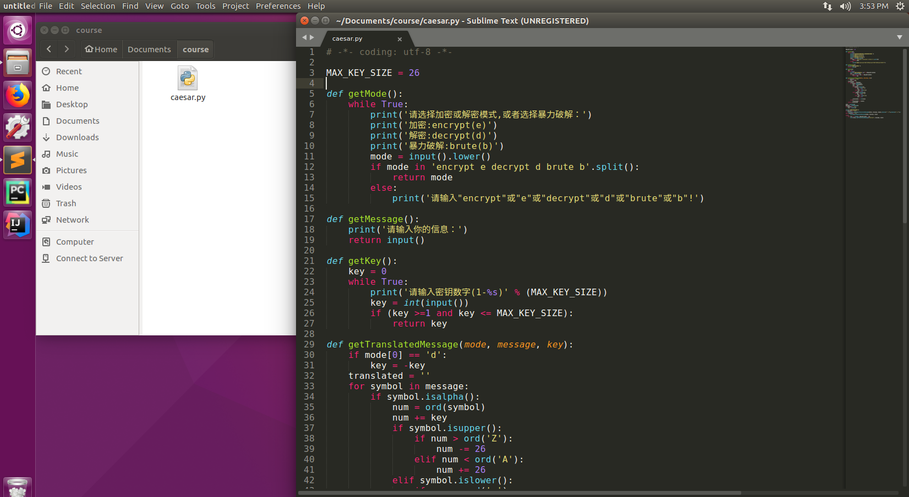
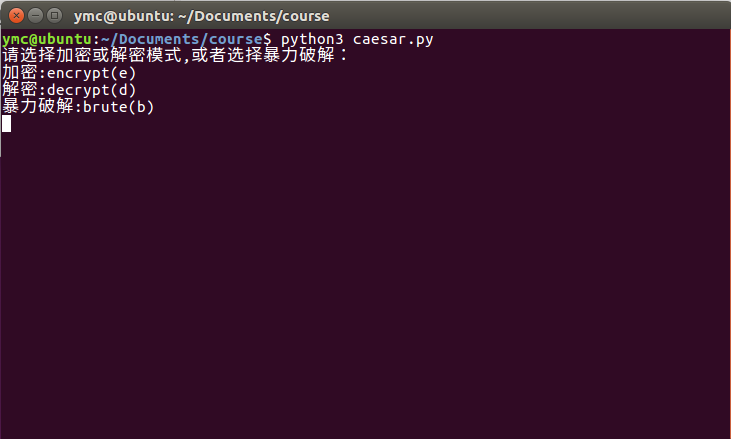

## 使用任意语言实现凯撒密码加解密

### 【目的】
1. 实现凯撒密码加密，并且能够自定义key的大小
2. 实现凯撒密码解密
3. 利用穷举法破解凯撒密码

### 【环境】
* 操作机：Ubuntu-crypto
* 密码：toor
* 参考代码存放位置：\Home\crypto\Documents\course

### 【工具】
- Sublime Text或gedit（如果环境里面没有sublime请使用gedit）
- python3

### 【原理】
#### 加密原理
- 凯撒加密其实是通过将明文中每个字符，按照字符表中顺序，全部后移K(K为密钥，K<字符表总数)位，得到新的字符，即密文。
#### 解密原理
- 解密，其实也就是加密的反过程，凯撒解密将密文中每个字符，按照字符表中顺序，全部前移N(加密是后移几位，解密就前移几位)位，得到新的字符即为明文。
- （注意：字符表中每个字符必须唯一，字符表中不能同时存在两个或者两个以上相同的字符。密钥的范围： 0<密钥<字符表总数。）

### 【实验步骤】

#### 参考代码 python
```python
# -*- coding: utf-8 -*-

MAX_KEY_SIZE = 26

def getMode():
    while True:
        print('请选择加密或解密模式,或者选择暴力破解：')
        print('加密:encrypt(e)')
        print('解密:decrypt(d)')
        print('暴力破解:brute(b)')
        mode = input().lower()
        if mode in 'encrypt e decrypt d brute b'.split():
            return mode
        else:
            print('请输入"encrypt"或"e"或"decrypt"或"d"或"brute"或"b"!')

def getMessage():
    print('请输入你的信息：')
    return input()

def getKey():
    key = 0
    while True:
        print('请输入密钥数字(1-%s)' % (MAX_KEY_SIZE))
        key = int(input())
        if (key >=1 and key <= MAX_KEY_SIZE):
            return key

def getTranslatedMessage(mode, message, key):
    if mode[0] == 'd':
        key = -key
    translated = ''
    for symbol in message:
        if symbol.isalpha():
            num = ord(symbol)
            num += key
            if symbol.isupper():
                if num > ord('Z'):
                    num -= 26
                elif num < ord('A'):
                    num += 26
            elif symbol.islower():
                if num > ord('z'):
                    num -= 26
                elif num < ord('a'):
                    num += 26

            translated += chr(num)
        else:
            translated += symbol
    return translated

mode = getMode()
message = getMessage()
if mode[0] != 'b':
    key = getKey()

print('你要破译的信息是:')
if mode[0] == 'e':
    print(str.upper(getTranslatedMessage(mode, message, key)).replace(" ","").replace(".","").replace(",","").replace("\r",""))
elif mode[0]== 'd':
        print(getTranslatedMessage(mode, message, key))
else:
    for key in range(1, MAX_KEY_SIZE + 1):
        print(key, getTranslatedMessage('decrypt', message, key))
```

首先，新建一个空白的python文件，并粘贴参考代码




然后，在文件所在目录打开terminal，运行python文件
（**由于本案例使用python3编写，因此运行时应使用python3运行**）


### 【总结】
- 通过本节实验，让学员掌握利用凯撒密码进行加解密的方式，保证文件传输的安全。

