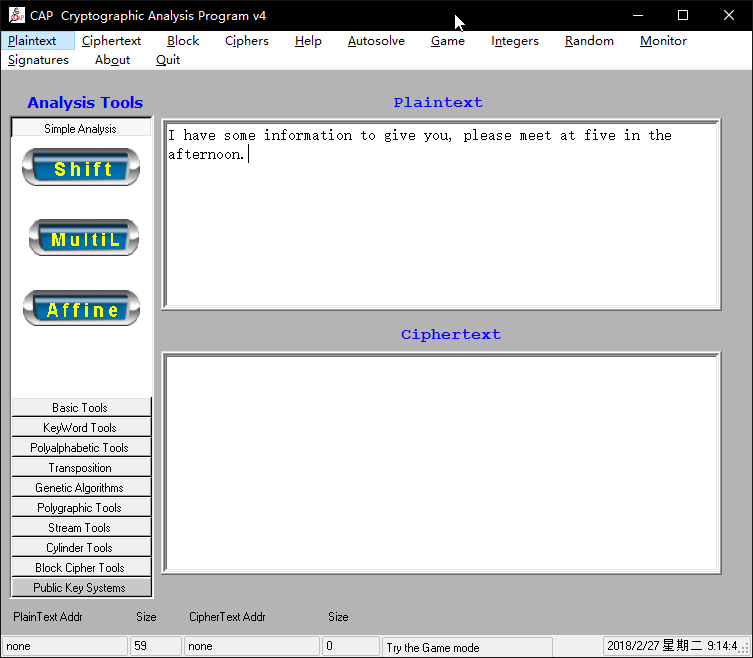
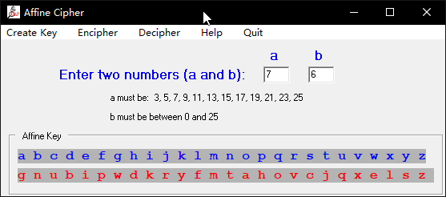
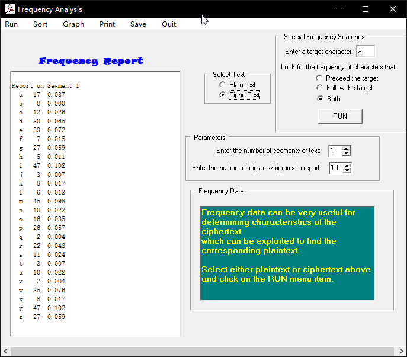
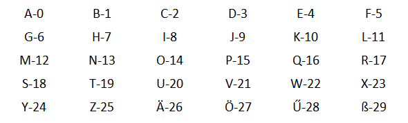
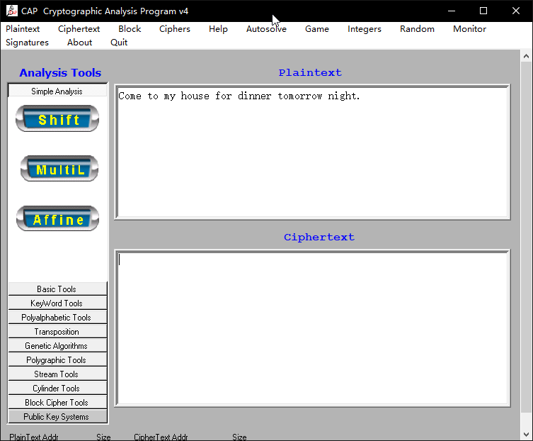
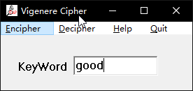

## 第一题

### 【目的】
使用仿射密码进行加密

### 【环境】
本机运行

### 【工具】
CAP4

### 【原理】
仿射加密法

### 【解题步骤】
1. 将明文复制到CAP4的plaintext文本框中

2. 点击上方功能栏中Ciphers选项，选择Affine 功能


3. 输入密钥（7,6）

4. 点击Create Key生成新的字母映射

5. 点击Encipher，在ciphertext中得到密文


## 第二题

### 【目的】
分析变形后的单表替换密码

### 【环境】
本机运行

### 【工具】
无

### 【原理】
单表替换密码

### 【解题步骤】
**1. 推测使用的加密方法**
>23080120 19 200805 14011305 1506 200805 160907 1514 200805 0718050514 0103180519 19081523

观察数字，我们可以推测出空格应该是单词之间的分隔符，其次，我们发现，每一串数字的个数都是偶数，那我们可以推测可能是两位数代表一个字母。

**2. 确定对应关系**
我们继续观察，字母与数字的对应关系应该是01-a，02-b，依次类推。

**3. 得出明文**
what s the name of the pig on the green acres show

## 第三题

### 【目的】
1. 掌握单词频率分析的方法
2. 学会通过上下文分析密文

### 【环境】
1. 本机运行

### 【工具】
CAP4
文本编辑器（Sublime Text）

### 【原理】
1. 频率分析法

### 【解题步骤】
**1. 查看密文**
```
MEYLGVIWAMEYOPINYZGWYEGMZRUUYPZAIXILGVSIZZMPGKKDWOMEPGROEIWGPCEIPAMDKKEYCIUYMGIFRWCEGLOPINYZHRZMPDNYWDWOGWITDWYSEDCEEIAFYYWMPIDWYAGTYPIKGLMXFPIWCEHRZMMEYMEDWOMGQRYWCEUXMEDPZMQRGMEEYAPISDWOFICJILYSNICYZEYMGGJIPRWIWAIHRUNIWAHRZMUDZZYAMEYFRWCEMRPWDWOPGRWAIOIDWSDMEIGWYMSGMEPYYEYHRUNYARNFRMSDMEWGOPYIMYPZRCCYZZIOIDWIWAIOIDWEYMPDYAILMYPMEYMYUNMDWOUGPZYKFRMIMKIZMEIAMGODTYDMRNIWASIKJYAISIXSDMEEDZWGZYDWMEYIDPZIXDWODIUZRPYMEYXIPYZGRPDMDZYIZXMGAYZNDZYSEIMXGRCIWWGMOYM
```

**2. 分析每个单词出现的频率**
- 在CAP4的ciphertext窗口粘贴密文


- 选择左边工具栏中：Basic tools 的Freq选项

- 打开后点击 run进行分析，点击sort，可从高到低排列


**3. 替换频率最高的字母**
表中出现频率最高的两个字母是I和Y，我们假设Y是e，把Y全部替换为e。替换后的密文：
```
MEeLGVIWAMEeOPINeZGWeEGMZRUUePZAIXILGVSIZZMPGKKDWOMEPGROEIWGPCEIPAMDKKEeCIUeMGIFRWCEGLOPINeZHRZMPDNeWDWOGWITDWeSEDCEEIAFeeWMPIDWeAGTePIKGLMXFPIWCEHRZMMEeMEDWOMGQReWCEUXMEDPZMQRGMEEeAPISDWOFICJILeSNICeZEeMGGJIPRWIWAIHRUNIWAHRZMUDZZeAMEeFRWCEMRPWDWOPGRWAIOIDWSDMEIGWeMSGMEPeeEeHRUNeARNFRMSDMEWGOPeIMePZRCCeZZIOIDWIWAIOIDWEeMPDeAILMePMEeMeUNMDWOUGPZeKFRMIMKIZMEIAMGODTeDMRNIWASIKJeAISIXSDMEEDZWGZeDWMEeIDPZIXDWODIUZRPeMEeXIPeZGRPDMDZeIZXMGAeZNDZeSEIMXGRCIWWGMOeM
```
**4. 寻找高频词组**
英语中，the这个单词出现的频率最高，因此我们可以寻找一下以e结尾的3个字母的组合，结果我们发现MEe这3个字母组合出现的频率最高，而且MEe出现在了密文的头部，因此，MEe很有可能是the。于是，我们假设M是t，E是h。替换后的密文为：
```
theLGVIWAtheOPINeZGWehGtZRUUePZAIXILGVSIZZtPGKKDWOthPGROhIWGPChIPAtDKKheCIUetGIFRWChGLOPINeZHRZtPDNeWDWOGWITDWeShDChhIAFeeWtPIDWeAGTePIKGLtXFPIWChHRZtthethDWOtGQReWChUXthDPZtQRGthheAPISDWOFICJILeSNICeZhetGGJIPRWIWAIHRUNIWAHRZtUDZZeAtheFRWChtRPWDWOPGRWAIOIDWSDthIGWetSGthPeeheHRUNeARNFRtSDthWGOPeItePZRCCeZZIOIDWIWAIOIDWhetPDeAILtePtheteUNtDWOUGPZeKFRtItKIZthIAtGODTeDtRNIWASIKJeAISIXSDthhDZWGZeDWtheIDPZIXDWODIUZRPetheXIPeZGRPDtDZeIZXtGAeZNDZeShItXGRCIWWGtOet
```

通过观察密文，我们发现了一个可以突破的字母组合：thPee，猜想这个可能是three，那么，把P替换为r，替换后的密文为：
```
theLGVIWAtheOrINeZGWehGtZRUUerZAIXILGVSIZZtrGKKDWOthrGROhIWGrChIrAtDKKheCIUetGIFRWChGLOrINeZHRZtrDNeWDWOGWITDWeShDChhIAFeeWtrIDWeAGTerIKGLtXFrIWChHRZtthethDWOtGQReWChUXthDrZtQRGthheArISDWOFICJILeSNICeZhetGGJIrRWIWAIHRUNIWAHRZtUDZZeAtheFRWChtRrWDWOrGRWAIOIDWSDthIGWetSGthreeheHRUNeARNFRtSDthWGOreIterZRCCeZZIOIDWIWAIOIDWhetrDeAILtertheteUNtDWOUGrZeKFRtItKIZthIAtGODTeDtRNIWASIKJeAISIXSDthhDZWGZeDWtheIDrZIXDWODIUZRretheXIreZGRrDtDZeIZXtGAeZNDZeShItXGRCIWWGtOet
```
此时，密文中出现了很多re、ter这类经常出现在英文中的字母组合，那我们可以判断，这个猜测应该是正确的。

**5. 对文末的字母组合进行合理猜测**
文末的字母组合是Oet，在英文中get、bet、let、set都是经常出现的组合，我们先假设O是g，那么把O替换成g，替换后的密文为：
```
theLGVIWAthegrINeZGWehGtZRUUerZAIXILGVSIZZtrGKKDWgthrGRghIWGrChIrAtDKKheCIUetGIFRWChGLgrINeZHRZtrDNeWDWgGWITDWeShDChhIAFeeWtrIDWeAGTerIKGLtXFrIWChHRZtthethDWgtGQReWChUXthDrZtQRGthheArISDWgFICJILeSNICeZhetGGJIrRWIWAIHRUNIWAHRZtUDZZeAtheFRWChtRrWDWgrGRWAIgIDWSDthIGWetSGthreeheHRUNeARNFRtSDthWGgreIterZRCCeZZIgIDWIWAIgIDWhetrDeAILtertheteUNtDWgUGrZeKFRtItKIZthIAtGgDTeDtRNIWASIKJeAISIXSDthhDZWGZeDWtheIDrZIXDWgDIUZRretheXIreZGRrDtDZeIZXtGAeZNDZeShItXGRCIWWGtget
```

**6. 对已经出现的字母组合进行合理猜想**
此时，我们列出可以分析的字母组合，thethDWg，grINe，其中，thethDWg我们可以先猜想为the thing ,此时DW对应的是i，n。我们先尝试替换：

```
theLGVInAthegrINeZGnehGtZRUUerZAIXILGVSIZZtrGKKingthrGRghInGrChIrAtiKKheCIUetGIFRnChGLgrINeZHRZtriNeningGnITineShiChhIAFeentrIineAGTerIKGLtXFrInChHRZtthethingtGQRenChUXthirZtQRGthheArISingFICJILeSNICeZhetGGJIrRnInAIHRUNInAHRZtUiZZeAtheFRnChtRrningrGRnAIgIinSithIGnetSGthreeheHRUNeARNFRtSithnGgreIterZRCCeZZIgIinInAIgIinhetrieAILtertheteUNtingUGrZeKFRtItKIZthIAtGgiTeitRNInASIKJeAISIXSithhiZnGZeintheIirZIXingiIUZRretheXIreZGRritiZeIZXtGAeZNiZeShItXGRCInnGtget
```

对于grINe，我们会联想到很多单词，例如grate，grace，grade，prape，grofe等，此时我们先猜想I是a，替换后出现了密文中出现了greater这个单词
```
theLGVanAthegraNeZGnehGtZRUUerZAaXaLGVSaZZtrGKKingthrGRghanGrCharAtiKKheCaUetGaFRnChGLgraNeZHRZtriNeningGnaTineShiChhaAFeentraineAGTeraKGLtXFranChHRZtthethingtGQRenChUXthirZtQRGthheAraSingFaCJaLeSNaCeZhetGGJarRnanAaHRUNanAHRZtUiZZeAtheFRnChtRrningrGRnAagainSithaGnetSGthreeheHRUNeARNFRtSithnG**greater**ZRCCeZZagainanAagainhetrieAaLtertheteUNtingUGrZeKFRtatKaZthaAtGgiTeitRNanASaKJeAaSaXSithhiZnGZeintheairZaXingiaUZRretheXareZGRritiZeaZXtGAeZNiZeShatXGRCannGtget
```

继续猜想graNe，先猜测N为c，进行替换后，出现了字母组合tricening，这并不能组成任何英文单词，所以排除N为c。

**7. 运用排除法**
破译共组进行到这里，已经遇到了瓶颈，此时我们发现，所有高频字母里面，只有o没有被替换，密文中，还剩G和Z这两个出现频率较高的字母没有被替换，我们先假设G是o，替换后的密文为：
```
theLoVanAthegraNeZonehotZRUUerZAaXaLoVSaZZtroKKingthroRghanorCharAtiKKheCaUetoaFRnChoLgraNeZHRZtriNeningonaTineShiChhaAFeentraineAoTeraKoLtXFranChHRZtthethingtoQRenChUXthirZtQRothheAraSingFaCJaLeSNaCeZhetooJarRnanAaHRUNanAHRZtUiZZeAtheFRnChtRrningroRnAagainSithaonetSothreeheHRUNeARNFRtSithnogreaterZRCCeZZagainanAagainhetrieAaLtertheteUNtingUorZeKFRtatKaZthaAtogiTeitRNanASaKJeAaSaXSithhiZnoZeintheairZaXingiaUZRretheXareZoRritiZeaZXtoAeZNiZeShatXoR**Cannotget**
```
观察文末，出现了Cannotget，我们可以猜测，C就是c。继续替换。

此时，密文中出现了Shich这个字母组合，很贴近which，因此我们假设S是w。将S替换为w。

替换后的密文为：
```
theLoVanAthegraNeZonehotZRUUerZAaXaLoVwaZZtroKKingthroRghanorcharAtiKKhecaUetoaFRnchoLgraNeZHRZtriNeningonaTinewhichhaAFeentraineAoTeraKoLtXFranchHRZt**thethingtoQRench**UXthirZtQRothheArawingFacJaLewNaceZhetooJarRnanAaHRUNanAHRZtUiZZeAtheFRnchtRrningroRnAagainwithaonetwothreeheHRUNeARNFRtwithnogreaterZRcceZZagainanAagainhetrieAaLtertheteUNtingUorZeKFRtatKaZthaAtogiTeitRNanAwaKJeAawaXwithhiZnoZeintheairZaXingiaUZRretheXareZoRritiZeaZXtoAeZNiZewhatXoRcannotget
```

**8. 结合上下文的意思**
thethingtoQRench，最后的单词应该是QRench，通过查找字典，我们发现了quench这个单词，是“解渴”的意思。将Q和R分别替换为q和u。

替换后的密文为：
```
theLoVanAthegraNeZonehotZuUUerZAaXaLoVwaZZtroKKingthroughanorcharAtiKKhecaUetoaFunchoLgraNeZHuZtriNeningonaTinewhichhaAFeentraineAoTeraKoLtXFranchHuZtthethingtoquenchUXthirZtquothheArawingFacJaLewNaceZhetooJarunanAaHuUNanAHuZtUiZZeAtheFunchturningrounAagainwithaonetwothreeheHuUNeAuNFutwithnogreaterZucceZZagainanAagainhetrieAaLtertheteUNtingUorZeKFutatKaZthaAtogiTeituNanAwaKJeAawaXwithhiZnoZeintheairZaXingiaUZuretheXareZouritiZeaZXtoAeZNiZe**whatXoucannotget**
```

whatXoucannotget，其中Xou让我们联想到了you，what you can not get，字义是通顺的，将X替换成y。替换后的密文为：

```
theLoVanAthegraNeZonehotZuUUerZAayaLoVwaZZtroKKing**through** **an** orcharAtiKKhecaUetoaFunchoLgraNeZHuZtriNeningonaTinewhichhaAFeentraineAoTeraKoLtyFranchHuZtthethingtoquenchUythirZtquothheArawingFacJaLewNaceZhetooJarunanAaHuUNanAHuZtUiZZeAtheFunchturningrounAagainwithaonetwothreeheHuUNeAuNFutwithnogreaterZucceZZagainanAagainhetrieAaLtertheteUNtingUorZeKFutatKaZthaAtogiTeituNanAwaKJeAawaywithhiZnoZeintheairZayingiaUZuretheyareZouritiZeaZytoAeZNiZewhatyoucannotget
```

在字典中查找orchar时，发现了orchard("果园")这个单词，我们猜测，A可能是d，进行替换。
```
theLoVandthegraNeZonehotZuUUerZdayaLoVwaZZtroKKingthroughanorchardtiKKhecaUetoaFunchoLgraNeZHuZtriNeningonaTinewhichhadFeentrainedoTeraKoLtyFranchHuZtthethingtoquenchUythirZtquothhedrawingFacJaLewNaceZhetooJarunandaHuUNandHuZtUiZZedtheFunchturningroundagainwithaonetwothreeheHuUNeduNFut **with no greater ZucceZZ again and again** hetriedaLtertheteUNtingUorZeKFutatKaZthadtogiTeituNandwaKJedawaywithhiZnoZeintheairZayingiaUZuretheyareZouritiZeaZytodeZNiZewhatyoucannotget
```

继续观察密文，with no greater ZucceZZ again and again，ZucceZZ可以联想到success，将Z替换成s，替换后的密文：

```
theLoVandthegraNesonehotsuUUersdayaLoVwasstroKKingthroughanorchardtiKKhecaUetoaFunchoLgraNesHustriNeningonaTinewhichhadFeentrainedoTeraKoLtyFranchHustthethingtoquenchUythirstquothhedrawingFacJaLewNaceshetooJarunandaHuUNandHustUissedtheFunchturningroundagainwithaonetwothreeheHuUNeduNFutwithnogreatersuccessagainandagain**hetriedaLterthe**teUNtingUorseKFutatKasthadtogiTeituNandwaKJedawaywithhisnoseintheairsayingiaUsuretheyaresouritiseasytodes
```

hetriedaLterthe可以拆分成 he tried aLter the，此时可以猜测aLter是after，L替换成f，替换后的密文为：
```
thefoVandthegraNesonehotsuUUersdayafoVwasstroKKingthroughanorchardtiKKhecaUetoaFunchofgraNesHustriNeningonaTinewhichhadFeentrainedoTeraKoftyFranchHustthethingtoquenchUythirstquothhedrawingFacJafewNaceshetooJarunandaHuUNandHustUissedtheFunchturningroundagainwithaonetwothreeheHuUNeduNFutwithnogreatersuccessagainandagainhetriedaftertheteUNtingUorseKFutatKasthadtogiTeituNandwaKJedawaywithhisnoseintheairsayingiaUsuretheyaresouritiseasytodesNisewhat
```
thefoVandthegraNes我们先拆开，得到 the foV and the graNes，foV我们查找字典可以猜测是fox（“狐狸”），把V替换成x，graNes我们猜测是grapes（“葡萄”），把N替换成p。
one hot suUUers day，结合语境，应该是summer's day，把U替换成m。替换后的密文为：
```
thefoxandthegrapesonehotsummersdaya**foxwasstroKKingthroughanorchard**tiKK**hecametoaFunchofgrapes**HustripeningonaTinewhichhadFeentrainedoTeraKoftyFranchHustthethingtoquenchmythirstquothhedrawingFacJafewpaceshetooJarunandaHumpandHustmissedtheFunchturningroundagainwithaonetwothreeheHumpedupFutwithnogreatersuccessagainandagainhetriedafterthetemptingmorseKFutatKasthadtogiTeitupandwaKJedawaywithhisnoseintheairsayingiamsuretheyaresouritiseasytodespisewhatyoucannotget
```

foxwasstroKKingthroughanorchard我们将其拆开，fox was stroKKing through an orchard，这里的stroKKing应该是strolling（漫步）。把K替换成l。

hecametoaFunchofgrapes我们将其拆开，he came to a Funch of grapes,这里的Funch应该是bunch（“串”），把F替换为b。

此时密文为：
```
thefoxandthegrapesonehotsummersdayafoxwasstrollingthroughanorchardtillhecametoabunchofgrapesHustripeningonaTine**whichhadbeentrainedoTeraloftybranch**HustthethingtoquenchmythirstquothhedrawingbacJafewpaces**hetooJarunandaHumpandHustmissedthebunch**turningroundagainwithaonetwothreeheHumpedupbutwithnogreatersuccessagainandagainhetriedafterthetemptingmorselbutatlasthadtogiTeitupandwalJedawaywithhisnoseintheairsayingiamsuretheyaresouritiseasytodespisewhatyoucannotget
```

whichhadbeentrainedoTeraloftybranch我们将其拆开，which had been trained oTer a lofty branch，这里的oTer应该是over，把T替换为v。

hetooJarunandaHumpandHustandHustmissedthebunch我们将其拆开，he tooJ a run and a Hump and Hust missed the branch,这里的Hump和Hust应该对应的是jump和just，把H替换为j。tooJ应该对应的是took，把J替换为k。

**9. 最后得出明文**
```
thefoxandthegrapesonehotsummersdayafoxwasstrollingthroughanorchardtillhecametoabunchofgrapesjustripeningonavinewhichhadbeentrainedoveraloftybranchjustthethingtoquenchmythirstquothhedrawingbackafewpaceshetookarunandajumpandjustmissedthebunchturningroundagainwithaonetwothreehejumpedupbutwithnogreatersuccessagainandagainhetriedafterthetemptingmorselbutatlasthadtogiveitupandwalkedawaywithhisnoseintheairsayingiamsuretheyaresouritiseasytodespisewhatyoucannotget
```

**10. 整理一下，加上标点符号**

'the fox and the grapes'

One hot summer's day, a fox was strolling through an orchard till he came to abunch of grapes just ripening on a vine which had been trained over a lofty branch . 'Just the thing to quench my thirst ,' quoth he . Drawing back a few paces , he took a run and a jump and just missed the bunch . Turnin ground again with a one , two , three , he jumped up , but with no greater success . Again and again he tried after the tempting morsel , but at last had to give it up , and walked away with his nose in the air , saying ' I am sure they are sour.' It is easy to despise what you can not get .

## 第四题

### 【目的】
了解仿射加密的数学原理

### 【环境】
本机运行

### 【工具】
无

### 【原理】
仿射加密法

### 【解题步骤】
已知字母映射


1. 根据仿射密码公式

$$C=(aM+b)mod 26$$

$$M=a^{-1}*(C-b)mod26$$

此时，字母的数量是30个，所以应该改成 $mod30$
因此，公式为：

> 加密公式：$C=(aM+b)mod30$

> 解密公式：$M=a^{-1}*(C-b)mod30$

2. 根据课堂学习内容可知，a需要与30互素，那么a必须在如下集合中：

> $$a \in \{ 1,,7,11,13,17,19,23,27,29 \} $$

密钥空间$=9*30=270$

3.已知密钥（17,1）和密文ä u β w β，

由a=17，且$a*a^{-1}\equiv1 mod30$

$17*a^{-1}=30*n+1$其中，n为大于等于0的正整数，$a^{-1}$的取值范围为a的取值范围（此处的$a^{-1}$不是1/a，而是a的逆元）

通过计算可得，$a^{-1}$的值为23

将密文映射为数字：26,20,29,22,29

根据解密公式可得：5,17,14,3,14

还原为明文：frodo

## 第五题

### 【目的】
掌握维吉尼亚密码

### 【环境】
本机运行

### 【工具】
CAP4

### 【原理】
维吉尼亚加密法

### 【解题步骤】
- 将明文复制到plaintext中



- 点击ciphers选项中的vigenere

- 输入密钥good



- 点击encipher，生成密钥
