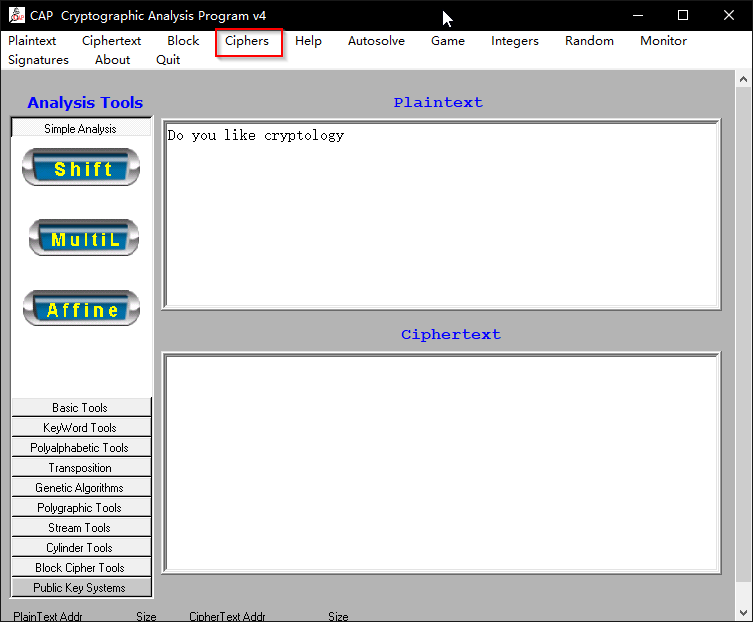
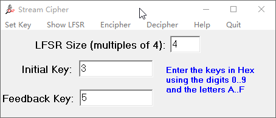

## 在CAP4软件中实现流加密法
###【目的】
掌握LFSR的加密过程
### 【环境】
本地运行
### 【工具】
CAP4
### 【原理】
LFSR加密法
### 【实验步骤】
**1. 将需要加密的密文复制到CAP的plaintext中**
> Do you like cryptology

**2. 选择Ciphers中的stream功能**
>本次我们假设有4个触发器，并且初始状态为$s_0,s_1,s_2,s_3=(1,1,0,0)$，反馈系数为$p_0,p_1,p_2,p_3=(1,0,1,0)$

因为在LFSR中触发器是从右向左排列的，CAP中需要输入的十六进制。我们需要做一个转换。initial key=0011=3，feedback key=0101=5

**3. 点击Show LFSR**

此时我们得到了一个图形化的LFSR

**4. 查看LFSR的密钥序列周期**
已知LFSR的最大长度为$$2^3-1=7$$，那么我们先查看密钥序列的前14位（此处查看前14为是为了更直观的显示周期性）

此时我们发现密钥的周期是6位

**5. 生成密文**
点击Encipher 生成密文

