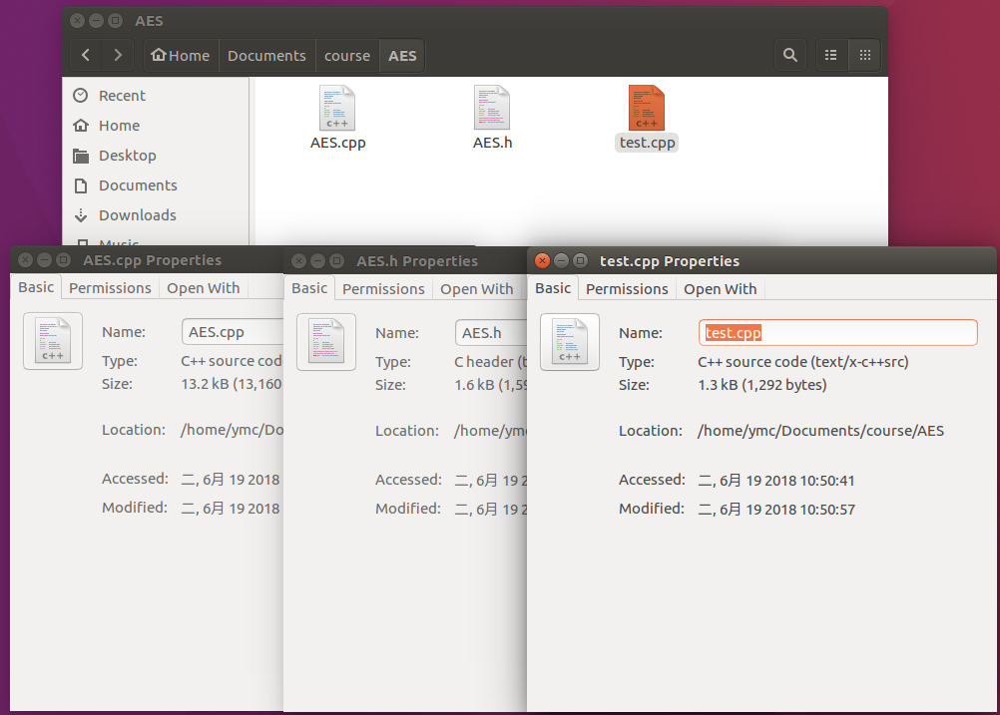
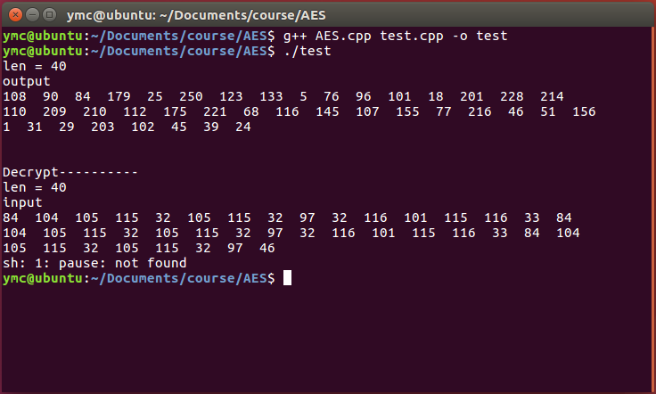

## C++实现AES加密

### 【目的】
1. 了解AES各个加密的过程
2. 在算法中标注各个函数的起到的功能
3. 用你的算法进行加密，通过与AES加密软件结果进行比对，查看自己的算法是否正确

### 【环境】
- 操作机：Ubuntu-crypto
- 密码：toor
- 参考代码存放位置：\Home\crypto\Documents\course

### 【工具】
- g++

### 【原理】
- AES算法基于排列和置换运算。排列是对数据重新进行安排，置换是将一个数据单元替换为另一个。AES 使用几种不同的方法来执行排列和置换运算。 
- AES是一个迭代的、对称密钥分组的密码，它可以使用128、192 和 256 位密钥，并且用 128 位（16字节）分组加密和解密数据。与公共密钥密码使用密钥对不同，对称密钥密码使用相同的密钥加密和解密数据。通过分组密码返回的加密数据的位数与输入数据相同。迭代加密使用一个循环结构，在该循环中重复置换和替换输入数据。

### 【实验步骤】

#### 参考代码C++

**AES.h**
```c++
/*
 * FileName : AES.h
 * 
 */
#ifndef __AES_H__
#define __AES_H__

#include <cstdio>

extern void print(unsigned char* state, int len);

class AES  
{
public:
	AES(unsigned char* key = NULL);
	virtual ~AES();
	void SetKey(unsigned char *key);
	unsigned char* Cipher(unsigned char* input, unsigned char* output);
	unsigned char* InvCipher(unsigned char* input, unsigned char* output);
	void* Cipher(void* input, void *output, int length=0);
	void* InvCipher(void* input,void *output, int length);

private:
	unsigned char Sbox[256];
	unsigned char InvSbox[256];
	unsigned char w[11][4][4];

	void KeyExpansion(unsigned char* key, unsigned char w[][4][4]);
	unsigned char FFmul(unsigned char a, unsigned char b);

	void SubBytes(unsigned char state[][4]);
	void ShiftRows(unsigned char state[][4]);
	void MixColumns(unsigned char state[][4]);
	void AddRoundKey(unsigned char state[][4], unsigned char k[][4]);

	void InvSubBytes(unsigned char state[][4]);
	void InvShiftRows(unsigned char state[][4]);
	void InvMixColumns(unsigned char state[][4]);
};

enum AESMode_t { MODE_OFB = 1, MODE_CFB, MODE_CBC, MODE_ECB };
class AESModeOfOperation {
private:
	AES *m_aes;
	AESMode_t	  m_mode;
	unsigned char m_key[16];
	unsigned char m_iv[16];
//	bool		  m_firstround;
public:
	AESModeOfOperation();
	~AESModeOfOperation();
	void set_mode(AESMode_t _mode);
	//AESMode_t get_mode();
	void set_key (unsigned char *key);
	void set_iv(unsigned char *iv);
	int  Encrypt(unsigned char *input, int length, unsigned char *output);
	int  Decrypt(unsigned char *input, int length, unsigned char *output);
};


#endif 
```
**AES.cpp**
```c++
// AES算法实验.cpp: 定义控制台应用程序的入口点。
//

#include "AES.h"
#include <cstdio>
#include <cstring>
#include <cassert>

AES::AES(unsigned char* key)
{
	unsigned char sBox[] =
	{ /*  0    1    2    3    4    5    6    7    8    9    a    b    c    d    e    f */ 
		0x63,0x7c,0x77,0x7b,0xf2,0x6b,0x6f,0xc5,0x30,0x01,0x67,0x2b,0xfe,0xd7,0xab,0x76, /*0*/  
		0xca,0x82,0xc9,0x7d,0xfa,0x59,0x47,0xf0,0xad,0xd4,0xa2,0xaf,0x9c,0xa4,0x72,0xc0, /*1*/
		0xb7,0xfd,0x93,0x26,0x36,0x3f,0xf7,0xcc,0x34,0xa5,0xe5,0xf1,0x71,0xd8,0x31,0x15, /*2*/ 
		0x04,0xc7,0x23,0xc3,0x18,0x96,0x05,0x9a,0x07,0x12,0x80,0xe2,0xeb,0x27,0xb2,0x75, /*3*/ 
		0x09,0x83,0x2c,0x1a,0x1b,0x6e,0x5a,0xa0,0x52,0x3b,0xd6,0xb3,0x29,0xe3,0x2f,0x84, /*4*/ 
		0x53,0xd1,0x00,0xed,0x20,0xfc,0xb1,0x5b,0x6a,0xcb,0xbe,0x39,0x4a,0x4c,0x58,0xcf, /*5*/
		0xd0,0xef,0xaa,0xfb,0x43,0x4d,0x33,0x85,0x45,0xf9,0x02,0x7f,0x50,0x3c,0x9f,0xa8, /*6*/  
		0x51,0xa3,0x40,0x8f,0x92,0x9d,0x38,0xf5,0xbc,0xb6,0xda,0x21,0x10,0xff,0xf3,0xd2, /*7*/ 
		0xcd,0x0c,0x13,0xec,0x5f,0x97,0x44,0x17,0xc4,0xa7,0x7e,0x3d,0x64,0x5d,0x19,0x73, /*8*/ 
		0x60,0x81,0x4f,0xdc,0x22,0x2a,0x90,0x88,0x46,0xee,0xb8,0x14,0xde,0x5e,0x0b,0xdb, /*9*/ 
		0xe0,0x32,0x3a,0x0a,0x49,0x06,0x24,0x5c,0xc2,0xd3,0xac,0x62,0x91,0x95,0xe4,0x79, /*a*/
		0xe7,0xc8,0x37,0x6d,0x8d,0xd5,0x4e,0xa9,0x6c,0x56,0xf4,0xea,0x65,0x7a,0xae,0x08, /*b*/
		0xba,0x78,0x25,0x2e,0x1c,0xa6,0xb4,0xc6,0xe8,0xdd,0x74,0x1f,0x4b,0xbd,0x8b,0x8a, /*c*/ 
		0x70,0x3e,0xb5,0x66,0x48,0x03,0xf6,0x0e,0x61,0x35,0x57,0xb9,0x86,0xc1,0x1d,0x9e, /*d*/
		0xe1,0xf8,0x98,0x11,0x69,0xd9,0x8e,0x94,0x9b,0x1e,0x87,0xe9,0xce,0x55,0x28,0xdf, /*e*/ 
		0x8c,0xa1,0x89,0x0d,0xbf,0xe6,0x42,0x68,0x41,0x99,0x2d,0x0f,0xb0,0x54,0xbb,0x16  /*f*/
	};
	unsigned char invsBox[256] = 
	{ /*  0    1    2    3    4    5    6    7    8    9    a    b    c    d    e    f  */  
		0x52,0x09,0x6a,0xd5,0x30,0x36,0xa5,0x38,0xbf,0x40,0xa3,0x9e,0x81,0xf3,0xd7,0xfb, /*0*/ 
		0x7c,0xe3,0x39,0x82,0x9b,0x2f,0xff,0x87,0x34,0x8e,0x43,0x44,0xc4,0xde,0xe9,0xcb, /*1*/
		0x54,0x7b,0x94,0x32,0xa6,0xc2,0x23,0x3d,0xee,0x4c,0x95,0x0b,0x42,0xfa,0xc3,0x4e, /*2*/ 
		0x08,0x2e,0xa1,0x66,0x28,0xd9,0x24,0xb2,0x76,0x5b,0xa2,0x49,0x6d,0x8b,0xd1,0x25, /*3*/ 
		0x72,0xf8,0xf6,0x64,0x86,0x68,0x98,0x16,0xd4,0xa4,0x5c,0xcc,0x5d,0x65,0xb6,0x92, /*4*/ 
		0x6c,0x70,0x48,0x50,0xfd,0xed,0xb9,0xda,0x5e,0x15,0x46,0x57,0xa7,0x8d,0x9d,0x84, /*5*/ 
		0x90,0xd8,0xab,0x00,0x8c,0xbc,0xd3,0x0a,0xf7,0xe4,0x58,0x05,0xb8,0xb3,0x45,0x06, /*6*/ 
		0xd0,0x2c,0x1e,0x8f,0xca,0x3f,0x0f,0x02,0xc1,0xaf,0xbd,0x03,0x01,0x13,0x8a,0x6b, /*7*/
		0x3a,0x91,0x11,0x41,0x4f,0x67,0xdc,0xea,0x97,0xf2,0xcf,0xce,0xf0,0xb4,0xe6,0x73, /*8*/ 
		0x96,0xac,0x74,0x22,0xe7,0xad,0x35,0x85,0xe2,0xf9,0x37,0xe8,0x1c,0x75,0xdf,0x6e, /*9*/
		0x47,0xf1,0x1a,0x71,0x1d,0x29,0xc5,0x89,0x6f,0xb7,0x62,0x0e,0xaa,0x18,0xbe,0x1b, /*a*/
		0xfc,0x56,0x3e,0x4b,0xc6,0xd2,0x79,0x20,0x9a,0xdb,0xc0,0xfe,0x78,0xcd,0x5a,0xf4, /*b*/ 
		0x1f,0xdd,0xa8,0x33,0x88,0x07,0xc7,0x31,0xb1,0x12,0x10,0x59,0x27,0x80,0xec,0x5f, /*c*/ 
		0x60,0x51,0x7f,0xa9,0x19,0xb5,0x4a,0x0d,0x2d,0xe5,0x7a,0x9f,0x93,0xc9,0x9c,0xef, /*d*/ 
		0xa0,0xe0,0x3b,0x4d,0xae,0x2a,0xf5,0xb0,0xc8,0xeb,0xbb,0x3c,0x83,0x53,0x99,0x61, /*e*/ 
		0x17,0x2b,0x04,0x7e,0xba,0x77,0xd6,0x26,0xe1,0x69,0x14,0x63,0x55,0x21,0x0c,0x7d  /*f*/
	}; 
	memcpy(Sbox, sBox, 256);
	memcpy(InvSbox, invsBox, 256);
	if (key != NULL) {
		KeyExpansion(key, w);
	}
}

AES::~AES()
{

}

void AES::SetKey (unsigned char *key) {
	KeyExpansion(key, w);
}

unsigned char* AES::Cipher(unsigned char* input, unsigned char *output)
{
	unsigned char state[4][4];
	int i,r,c;

	for(r=0; r<4; r++)
	{
		for(c=0; c<4 ;c++)
		{
			state[r][c] = input[c*4+r];
		}
	}

	AddRoundKey(state,w[0]);

	for(i=1; i<=10; i++)
	{
		SubBytes(state);
		ShiftRows(state);
		if(i!=10)MixColumns(state);
		AddRoundKey(state,w[i]);
	}

	for(r=0; r<4; r++)
	{
		for(c=0; c<4 ;c++)
		{
			output[c*4+r] = state[r][c];
		}
	}

	return output;
}

unsigned char* AES::InvCipher(unsigned char* input, unsigned char *output)
{
	unsigned char state[4][4];
	int i,r,c;

	for(r=0; r<4; r++)
	{
		for(c=0; c<4 ;c++)
		{
			state[r][c] = input[c*4+r];
		}
	}

	AddRoundKey(state, w[10]);
	for(i=9; i>=0; i--)
	{
		InvShiftRows(state);
		InvSubBytes(state);
		AddRoundKey(state, w[i]);
		if(i)
		{
			InvMixColumns(state);
		}
	}
	
	for(r=0; r<4; r++)
	{
		for(c=0; c<4 ;c++)
		{
			output[c*4+r] = state[r][c];
		}
	}
	return output;
}

void* AES::Cipher(void* input,  void *output, int length)
{
	unsigned char* in = (unsigned char*) input;
	unsigned char* out = (unsigned char*) output;
	int i;
	if(!length)
	{
		while(*(in+length++));
		in = (unsigned char*) input;
	}
	for(i=0; i<length; i+=16)
	{
		Cipher(in+i, out+i);
	}
	return output;
}

void* AES::InvCipher(void* input, void* output, int length)
{
	unsigned char* in = (unsigned char*) input;
	unsigned char* out = (unsigned char*) output;
	int i;
	for(i=0; i<length; i+=16)
	{
		InvCipher(in+i, out+i);
	}
	return output;
}

void AES::KeyExpansion(unsigned char* key, unsigned char w[][4][4])
{
	int i,j,r,c;
	unsigned char rc[] = {0x01, 0x02, 0x04, 0x08, 0x10, 0x20, 0x40, 0x80, 0x1b, 0x36};
	for(r=0; r<4; r++)
	{
		for(c=0; c<4; c++)
		{
			w[0][r][c] = key[r+c*4];
		}
	}
	for(i=1; i<=10; i++)
	{
		for(j=0; j<4; j++)
		{
			unsigned char t[4];
			for(r=0; r<4; r++)
			{
				t[r] = j ? w[i][r][j-1] : w[i-1][r][3];
			}
			if(j == 0)
			{
				unsigned char temp = t[0];
				for(r=0; r<3; r++)
				{
					t[r] = Sbox[t[(r+1)%4]];
				}
				t[3] = Sbox[temp];
				t[0] ^= rc[i-1];
			}
			for(r=0; r<4; r++)
			{
				w[i][r][j] = w[i-1][r][j] ^ t[r];
			}
		}
	}
}

unsigned char AES::FFmul(unsigned char a, unsigned char b)
{
	unsigned char bw[4];
	unsigned char res=0;
	int i;
	bw[0] = b;
	for(i=1; i<4; i++)
	{
		bw[i] = bw[i-1]<<1;
		if(bw[i-1]&0x80)
		{
			bw[i]^=0x1b;
		}
	}
	for(i=0; i<4; i++)
	{
		if((a>>i)&0x01)
		{
			res ^= bw[i];
		}
	}
	return res;
}

void AES::SubBytes(unsigned char state[][4])
{
	int r,c;
	for(r=0; r<4; r++)
	{
		for(c=0; c<4; c++)
		{
			state[r][c] = Sbox[state[r][c]];
		}
	}
}

void AES::ShiftRows(unsigned char state[][4])
{
	unsigned char t[4];
	int r,c;
	for(r=1; r<4; r++)
	{
		for(c=0; c<4; c++)
		{
			t[c] = state[r][(c+r)%4];
		}
		for(c=0; c<4; c++)
		{
			state[r][c] = t[c];
		}
	}
}

void AES::MixColumns(unsigned char state[][4])
{
	unsigned char t[4];
	int r,c;
	for(c=0; c< 4; c++)
	{
		for(r=0; r<4; r++)
		{
			t[r] = state[r][c];
		}
		for(r=0; r<4; r++)
		{
			state[r][c] = FFmul(0x02, t[r])
						^ FFmul(0x03, t[(r+1)%4])
						^ FFmul(0x01, t[(r+2)%4])
						^ FFmul(0x01, t[(r+3)%4]);
		}
	}
}

void AES::AddRoundKey(unsigned char state[][4], unsigned char k[][4])
{
	int r,c;
	for(c=0; c<4; c++)
	{
		for(r=0; r<4; r++)
		{
			state[r][c] ^= k[r][c];
		}
	}
}

void AES::InvSubBytes(unsigned char state[][4])
{
	int r,c;
	for(r=0; r<4; r++)
	{
		for(c=0; c<4; c++)
		{
			state[r][c] = InvSbox[state[r][c]];
		}
	}
}

void AES::InvShiftRows(unsigned char state[][4])
{
	unsigned char t[4];
	int r,c;
	for(r=1; r<4; r++)
	{
		for(c=0; c<4; c++)
		{
			t[c] = state[r][(c-r+4)%4];
		}
		for(c=0; c<4; c++)
		{
			state[r][c] = t[c];
		}
	}
}

void AES::InvMixColumns(unsigned char state[][4])
{
	unsigned char t[4];
	int r,c;
	for(c=0; c< 4; c++)
	{
		for(r=0; r<4; r++)
		{
			t[r] = state[r][c];
		}
		for(r=0; r<4; r++)
		{
			state[r][c] = FFmul(0x0e, t[r])
						^ FFmul(0x0b, t[(r+1)%4])
						^ FFmul(0x0d, t[(r+2)%4])
						^ FFmul(0x09, t[(r+3)%4]);
		}
	}
}

/**************************************************************/
//AESModeOfOperation

AESModeOfOperation::AESModeOfOperation() {
	m_mode = MODE_ECB;
	m_aes = NULL;
	memset(m_key, 0, 16);
	memset(m_iv, 0, 16);
	m_aes = new AES(m_key);
	assert(m_aes != NULL);
}

AESModeOfOperation::~AESModeOfOperation() {
	delete m_aes;
}

void AESModeOfOperation::set_mode(AESMode_t _mode) {
	m_mode = _mode;
}

void AESModeOfOperation::set_key(unsigned char *_key) {
	assert(_key != NULL);
	memcpy(m_key, _key, 16);
	m_aes->SetKey(m_key);
}
void AESModeOfOperation::set_iv(unsigned char *_iv) {
	assert(_iv != NULL);
	memcpy(m_iv, _iv, 16);
}

int AESModeOfOperation::Encrypt(unsigned char *_in, int _length, unsigned char *_out) {
	bool first_round = true;
	int rounds = 0;
	int start = 0;
	int end = 0;
	unsigned char input[16] = {0};
	unsigned char output[16] = {0};
	unsigned char ciphertext[16] = {0};
	unsigned char cipherout[256] = {0};
	unsigned char plaintext[16] = {0};
	int co_index = 0;
	// 1. get rounds
	if ( _length % 16 == 0) {
		rounds = _length / 16;
	} else {
		rounds = _length / 16 + 1;
	}
	// 2. for all rounds 
	for (int j = 0; j < rounds; ++j) {
		start = j*16;
		end = j*16 + 16;
		if (end > _length) end = _length;	// end of input
		// 3. copyt input to m_plaintext
		memset(plaintext, 0, 16);
		memcpy(plaintext, _in + start, end - start);
		// 4. handle all modes
		if (m_mode == MODE_CFB) {
			if (first_round == true) {
				m_aes->Cipher(m_iv, output);
				first_round = false;
			} else {
				m_aes->Cipher(input,output);
			}
			for (int i = 0; i < 16; ++i) {
				if ( (end - start) - 1 < i) {
					ciphertext[i] = 0 ^ output[i];
				} else {
					ciphertext[i] = plaintext[i] ^ output[i];
				}
			}
			for (int k = 0 ; k < end - start; ++k) {
				cipherout[co_index++] = ciphertext[k];
			}
			//memset(input,0, 16);
			memcpy(input,ciphertext, 16);
		} else if (m_mode == MODE_OFB) {			// MODE_OFB
			if (first_round == true) {
				m_aes->Cipher(m_iv,output); // 
				first_round = false;
			} else {
				m_aes->Cipher(input, output);
			}
			// ciphertext = plaintext ^ output
			for (int i = 0; i < 16; ++i) {
				if ( (end - start) - 1 < i) {
					ciphertext[i] = 0 ^ output[i];
				} else {
					ciphertext[i] = plaintext[i] ^ output[i];
				}
			}
			// 
			for (int k = 0; k < end - start; ++k) {
				cipherout[co_index++] = ciphertext[k];
			}
			//memset(input,0,16);
			memcpy(input, output, 16);
		} else if (m_mode == MODE_CBC) {			// MODE_CBC
			printf("-----plaintext------");
			print(plaintext, 16);
			printf("--------------------\n");
//			printf("-----m_iv-----------\n");
//			print (m_iv, 16);
//			printf("--------------------\n");
			for (int i = 0; i < 16; ++i) {
				if (first_round == true) {
					input[i] = plaintext[i] ^ m_iv[i];
				} else {
					input[i] = plaintext[i] ^ ciphertext[i];
				}
			}
			first_round = false;
//			printf("^^^^^^^^^^^^\n");
//			print(input, 16);
//			printf("^^^^^^^^^^^^\n");
			m_aes->Cipher(input, ciphertext);
			printf("****ciphertext****");
			print(ciphertext, 16);
			printf("************\n");
			for (int k = 0; k < end - start; ++k){
				cipherout[co_index++] = ciphertext[k];
			}
			//memcpy(cipherout, ciphertext, 16);
			//co_index = 16;
		} else if (m_mode == MODE_ECB) {
			// TODO: 
		}
	}
	memcpy(_out, cipherout, co_index);
	return co_index;
}

int AESModeOfOperation::Decrypt(unsigned char *_in, int _length, unsigned char *_out) {
	// TODO :
	bool first_round = true;
	int rounds = 0;
	unsigned char ciphertext[16] = {0};
	unsigned char input[16] = {0};
	unsigned char output[16] = {0};
	unsigned char plaintext[16] = {0};
	unsigned char plainout[256] = {0};
	int po_index = 0 ;
	if (_length % 16 == 0) {
		rounds = _length / 16;
	} else {
		rounds = _length / 16 + 1;
	}
	
	int start = 0;
	int end = 0;
	
	for (int j = 0; j < rounds; j++) {
		start = j * 16;
		end   = start + 16;
		if ( end > _length) {
			end = _length;
		}
		memset(ciphertext, 0, 16);
		memcpy(ciphertext, _in + start, end - start);
		if ( m_mode == MODE_CFB ) {
			if (first_round = true) {
				m_aes->Cipher(m_iv, output);
				first_round = false;
			} else {
				m_aes->Cipher(input, output);
			}
			for (int i = 0; i < 16; i++) {
				if ( end - start - 1 < i) {
					plaintext[i] = output[i] ^ 0;
				} else {
					plaintext[i] = output[i] ^ ciphertext[i];
				}
			}
			for (int k = 0; k < end - start; ++k) {
				plainout[po_index++] = plaintext[k];
			}
			//memset(input, 0, 16);
			memcpy(input, ciphertext, 16);
		} else if (m_mode == MODE_OFB) {
			if (first_round == true) {
				m_aes->Cipher(m_iv, output);
				first_round = false;
			} else {
				m_aes->Cipher(input, output);
			}
			for (int i = 0; i < 16; i++) {
				if ( end - start -1 < i) {
					plaintext[i] = 0 ^ ciphertext[i];
					first_round = false;
				} else {
					plaintext[i] = output[i] ^ ciphertext[i];
				}
			}
			for (int k = 0; k < end - start; ++k) {
				plainout[po_index++] = plaintext[k];
			}
			memcpy(input, output, 16);
		} else if (m_mode == MODE_CBC) {
			printf("------ciphertext------");
			print(ciphertext, 16);
			printf("----------------------\n");
			m_aes->InvCipher(ciphertext, output);
			printf("------output------");
			print(output, 16);
			printf("----------------------\n");
			for (int i = 0; i < 16; ++i) {
				if ( first_round == true) {
					plaintext[i] =  m_iv[i] ^  output[i];
				} else {
					plaintext[i] = input[i] ^ output[i];
				}
			}
			first_round = false;
			for ( int k = 0; k < end - start; ++k) {
				plainout[po_index++] = plaintext[k];
			}
			memcpy(input, ciphertext, 16);
		} else {
			// TODO
		}
	}
    memcpy(_out, plainout, po_index);
    return po_index;
}


```

#### test.cpp
```c++
#include <cstring>
#include "AES.h"
#include <stdlib.h>

void print(unsigned char* state, int len);

int main(int argc, char* argv[])
{
	unsigned char input[] = {84, 104, 105, 115, 32, 105, 115, 32, 97, 32, 116, 101, 115, 116, 33, 84, 104, 105, 115, 32, 105, 115, 32, 97, 32, 116, 101, 115, 116, 33, 84, 104, 105, 115, 32, 105, 115, 32, 97, 46};
	unsigned char iv[]    = {103,35,148,239,76,213,47,118,255,222,123,176,106,134,98,92};
	unsigned char key[]   = {143,194,34,208,145,203,230,143,177,246,97,206,145,92,255,84};
	unsigned char output[100] ={0};
    unsigned char temp[100] = {0};
//	unsigned char 
	AESModeOfOperation moo;
	moo.set_key(key);
	moo.set_mode(MODE_OFB);
	moo.set_iv(iv);
    int olen = sizeof input;

    memcpy(temp, input, sizeof input);
	int len = moo.Encrypt(temp, olen, output);
	printf("len = %d\n", len);
    printf("output");
	print(output, len);
	printf("\n\nDecrypt----------\n");
	len = moo.Decrypt(output, len, input);
	printf("len = %d\n", len);
    printf("input");
	print(input, len);
	system("pause");
	
	return 0;
}

void print(unsigned char* state, int len)
{
	int i;
	for(i=0; i<len; i++)
	{
        if ( i%16 == 0) printf("\n");
//		printf("%s%X ",state[i]>15 ? "" : "0", state[i]);
        printf("%d  ", (int)(state[i] & 0xff));
	}
	printf("\n");
}
```
1. 分别创建`AES.h`、`AES.cpp`和测试文件`test.cpp`，拷贝参考代码到文件中


2. 编译文件
`g++ AES.cpp test.cpp -o test`

3. 运行编译后的程序`./test`


### 【总结】
- 通过本节实验的学习，掌握了AES算法加密的过程。可以在以后的实际编写过程中拓展功能，实现文件的加解密操作。