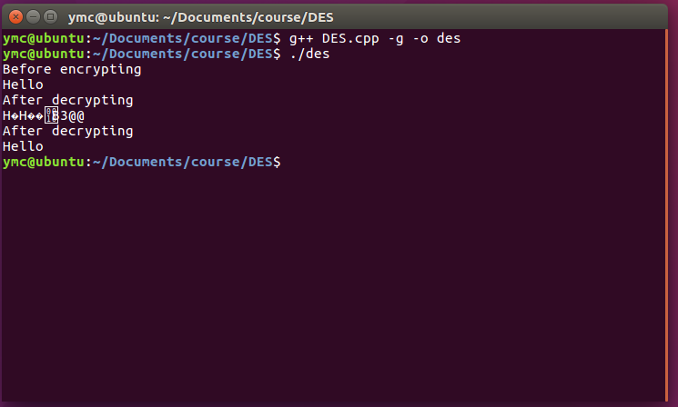

## C++实现DES加密

### 【目的】
1. 了解DES各个加密的过程
2. 在算法中标注各个函数的起到的功能
3. 用你的算法进行加密，通过与DES加密软件的结果进行比较，查看自己的算法是否正确。

### 【环境】
- 操作机：Ubuntu-crypto
- 密码：toor
- 参考代码存放位置：\Home\crypto\Documents\course

### 【工具】
- g++

### 【原理】
- DES的诞生
数据加密标准（ data encryption standard, DES ）是1977年美国联邦信息处理标准（FIPS）中所采用的一种对称密码。
它是由美国IBM公司研制的，是早期的称作Lucifer密码的一种发展和修改。DES在1975年3月17日首次被公布在联邦记录中，经过大量的公开讨论后，DES于1977年1月15日被正式批准并作为美国联邦信息处理标准，即FIPS-46，同年7月15日开始生效。规定每隔5年由美国国家保密局（national security agency, NSA）作出评估，并重新批准它是否继续作为联邦加密标准。
- 尽管DES密钥有64位，但用户只能定义其中的56位，其余的8位由算法提供。分别放在8、16、24、32、40、48、56和64位上。也就是每8位的密钥中包含了用户提供的7位和DES确定的1位，这样做是为了让每个8位的块都有奇数个奇偶校验位（即1的个数为奇数）。
- DES的基本结构是由乘积加密算法组成的。它对明文中每一个分组的加密过程都包含16轮，且每轮的操作完全相同。每一轮都会使用不同的子密钥，每个子密钥ki都是从主密钥k中推导出来的。

### 【实验步骤】

#### C++ 参考代码
```c++
#include <stdlib.h>
#include "memory.h"
#include "stdio.h"

enum
{
	ENCRYPT,
	DECRYPT
}; // ENCRYPT:加密,DECRYPT:解密
void Des_Run(char Out[8], char In[8], bool Type = ENCRYPT);
void Des_SetKey(const char Key[8]);                                     // 设置密钥
static void F_func(bool In[32], const bool Ki[48]);                     // f 函数
static void S_func(bool Out[32], const bool In[48]);                    // S 盒代替
static void Transform(bool *Out, bool *In, const char *Table, int len); // 变换
static void Xor(bool *InA, const bool *InB, int len);                   // 异或
static void RotateL(bool *In, int len, int loop);                       // 循环左移
static void ByteToBit(bool *Out, const char *In, int bits);             // 字节组转换成位组
static void BitToByte(char *Out, const bool *In, int bits);             // 位组转换成字节组
																		//置换IP表
const static char IP_Table[64] = {
	58, 50, 42, 34, 26, 18, 10, 2, 60, 52, 44, 36, 28, 20, 12, 4,
	62, 54, 46, 38, 30, 22, 14, 6, 64, 56, 48, 40, 32, 24, 16, 8,
	57, 49, 41, 33, 25, 17, 9, 1, 59, 51, 43, 35, 27, 19, 11, 3,
	61, 53, 45, 37, 29, 21, 13, 5, 63, 55, 47, 39, 31, 23, 15, 7 };
//逆置换IP-1表
const static char IPR_Table[64] = {
	40, 8, 48, 16, 56, 24, 64, 32, 39, 7, 47, 15, 55, 23, 63, 31,
	38, 6, 46, 14, 54, 22, 62, 30, 37, 5, 45, 13, 53, 21, 61, 29,
	36, 4, 44, 12, 52, 20, 60, 28, 35, 3, 43, 11, 51, 19, 59, 27,
	34, 2, 42, 10, 50, 18, 58, 26, 33, 1, 41, 9, 49, 17, 57, 25 };
//E位选择表(扩展置换表)
static const char E_Table[48] = {
	32, 1, 2, 3, 4, 5, 4, 5, 6, 7, 8, 9,
	8, 9, 10, 11, 12, 13, 12, 13, 14, 15, 16, 17,
	16, 17, 18, 19, 20, 21, 20, 21, 22, 23, 24, 25,
	24, 25, 26, 27, 28, 29, 28, 29, 30, 31, 32, 1 };
//P换位表(单纯换位表)
const static char P_Table[32] = {
	16, 7, 20, 21, 29, 12, 28, 17, 1, 15, 23, 26, 5, 18, 31, 10,
	2, 8, 24, 14, 32, 27, 3, 9, 19, 13, 30, 6, 22, 11, 4, 25 };
//PC1选位表(密钥生成置换表1)
const static char PC1_Table[56] = {
	57, 49, 41, 33, 25, 17, 9, 1, 58, 50, 42, 34, 26, 18,
	10, 2, 59, 51, 43, 35, 27, 19, 11, 3, 60, 52, 44, 36,
	63, 55, 47, 39, 31, 23, 15, 7, 62, 54, 46, 38, 30, 22,
	14, 6, 61, 53, 45, 37, 29, 21, 13, 5, 28, 20, 12, 4 };
//PC2选位表(密钥生成置换表2)
const static char PC2_Table[48] = {
	14, 17, 11, 24, 1, 5, 3, 28, 15, 6, 21, 10,
	23, 19, 12, 4, 26, 8, 16, 7, 27, 20, 13, 2,
	41, 52, 31, 37, 47, 55, 30, 40, 51, 45, 33, 48,
	44, 49, 39, 56, 34, 53, 46, 42, 50, 36, 29, 32 };
//左移位数表
const static char LOOP_Table[16] = {
	1, 1, 2, 2, 2, 2, 2, 2, 1, 2, 2, 2, 2, 2, 2, 1 };
// S盒
const static char S_Box[8][4][16] = {
	// S1
	14, 4, 13, 1, 2, 15, 11, 8, 3, 10, 6, 12, 5, 9, 0, 7,
	0, 15, 7, 4, 14, 2, 13, 1, 10, 6, 12, 11, 9, 5, 3, 8,
	4, 1, 14, 8, 13, 6, 2, 11, 15, 12, 9, 7, 3, 10, 5, 0,
	15, 12, 8, 2, 4, 9, 1, 7, 5, 11, 3, 14, 10, 0, 6, 13,
	//S2
	15, 1, 8, 14, 6, 11, 3, 4, 9, 7, 2, 13, 12, 0, 5, 10,
	3, 13, 4, 7, 15, 2, 8, 14, 12, 0, 1, 10, 6, 9, 11, 5,
	0, 14, 7, 11, 10, 4, 13, 1, 5, 8, 12, 6, 9, 3, 2, 15,
	13, 8, 10, 1, 3, 15, 4, 2, 11, 6, 7, 12, 0, 5, 14, 9,
	//S3
	10, 0, 9, 14, 6, 3, 15, 5, 1, 13, 12, 7, 11, 4, 2, 8,
	13, 7, 0, 9, 3, 4, 6, 10, 2, 8, 5, 14, 12, 11, 15, 1,
	13, 6, 4, 9, 8, 15, 3, 0, 11, 1, 2, 12, 5, 10, 14, 7,
	1, 10, 13, 0, 6, 9, 8, 7, 4, 15, 14, 3, 11, 5, 2, 12,
	//S4
	7, 13, 14, 3, 0, 6, 9, 10, 1, 2, 8, 5, 11, 12, 4, 15,
	13, 8, 11, 5, 6, 15, 0, 3, 4, 7, 2, 12, 1, 10, 14, 9,
	10, 6, 9, 0, 12, 11, 7, 13, 15, 1, 3, 14, 5, 2, 8, 4,
	3, 15, 0, 6, 10, 1, 13, 8, 9, 4, 5, 11, 12, 7, 2, 14,
	//S5
	2, 12, 4, 1, 7, 10, 11, 6, 8, 5, 3, 15, 13, 0, 14, 9,
	14, 11, 2, 12, 4, 7, 13, 1, 5, 0, 15, 10, 3, 9, 8, 6,
	4, 2, 1, 11, 10, 13, 7, 8, 15, 9, 12, 5, 6, 3, 0, 14,
	11, 8, 12, 7, 1, 14, 2, 13, 6, 15, 0, 9, 10, 4, 5, 3,
	//S6
	12, 1, 10, 15, 9, 2, 6, 8, 0, 13, 3, 4, 14, 7, 5, 11,
	10, 15, 4, 2, 7, 12, 9, 5, 6, 1, 13, 14, 0, 11, 3, 8,
	9, 14, 15, 5, 2, 8, 12, 3, 7, 0, 4, 10, 1, 13, 11, 6,
	4, 3, 2, 12, 9, 5, 15, 10, 11, 14, 1, 7, 6, 0, 8, 13,
	//S7
	4, 11, 2, 14, 15, 0, 8, 13, 3, 12, 9, 7, 5, 10, 6, 1,
	13, 0, 11, 7, 4, 9, 1, 10, 14, 3, 5, 12, 2, 15, 8, 6,
	1, 4, 11, 13, 12, 3, 7, 14, 10, 15, 6, 8, 0, 5, 9, 2,
	6, 11, 13, 8, 1, 4, 10, 7, 9, 5, 0, 15, 14, 2, 3, 12,
	//S8
	13, 2, 8, 4, 6, 15, 11, 1, 10, 9, 3, 14, 5, 0, 12, 7,
	1, 15, 13, 8, 10, 3, 7, 4, 12, 5, 6, 11, 0, 14, 9, 2,
	7, 11, 4, 1, 9, 12, 14, 2, 0, 6, 10, 13, 15, 3, 5, 8,
	2, 1, 14, 7, 4, 10, 8, 13, 15, 12, 9, 0, 3, 5, 6, 11 };

static bool SubKey[16][48]; // 16圈子密钥

void Des_Run(char Out[8], char In[8], bool Type)
{
	static bool M[64], Tmp[32], *Li = &M[0], *Ri = &M[32];
	ByteToBit(M, In, 64);          // 字节组转换成位组
	Transform(M, M, IP_Table, 64); // 变换
	if (Type == ENCRYPT)
	{
		for (int i = 0; i < 16; i++)
		{
			memcpy(Tmp, Ri, 32);
			F_func(Ri, SubKey[i]);
			Xor(Ri, Li, 32); // 异或
			memcpy(Li, Tmp, 32);
		}
	}
	else
	{
		for (int i = 15; i >= 0; i--)
		{
			memcpy(Tmp, Li, 32);
			F_func(Li, SubKey[i]);
			Xor(Li, Ri, 32); // 异或
			memcpy(Ri, Tmp, 32);
		}
	}
	Transform(M, M, IPR_Table, 64); // 变换
	BitToByte(Out, M, 64);
}

void Des_SetKey(const char Key[8])
{
	static bool K[64], *KL = &K[0], *KR = &K[28];
	ByteToBit(K, Key, 64);          // 字节组转换成位组
	Transform(K, K, PC1_Table, 56); // 变换
	for (int i = 0; i < 16; i++)
	{
		RotateL(KL, 28, LOOP_Table[i]);         // 循环左移
		RotateL(KR, 28, LOOP_Table[i]);         // 循环左移
		Transform(SubKey[i], K, PC2_Table, 48); // 变换
	}
}

void F_func(bool In[32], const bool Ki[48]) // f 函数
{
	static bool MR[48];
	Transform(MR, In, E_Table, 48); // 变换
	Xor(MR, Ki, 48);                // 异或
	S_func(In, MR);                 // S 盒代替
	Transform(In, In, P_Table, 32); // 变换
}

void S_func(bool Out[32], const bool In[48]) // S 盒代替,输入6位的数，输出4位的数，将第一六位对应的十进制数作为行，第二三四五为的对应十进制数作为列
{
	for (char i = 0, j, k; i < 8; i++, In += 6, Out += 4)
	{
		j = (In[0] << 1) + In[5];
		k = (In[1] << 3) + (In[2] << 2) + (In[3] << 1) + In[4];
		ByteToBit(Out, &S_Box[i][j][k], 4);
	}
}

void Transform(bool *Out, bool *In, const char *Table, int len) //变换
{
	static bool Tmp[256];
	for (int i = 0; i < len; i++)
	{
		Tmp[i] = In[Table[i] - 1];
	}
	memcpy(Out, Tmp, len);
}

void Xor(bool *InA, const bool *InB, int len) //异或
{
	for (int i = 0; i < len; i++)
	{
		InA[i] ^= InB[i];
	}
}

void RotateL(bool *In, int len, int loop) //循环左移
{
	static bool Tmp[256];
	memcpy(Tmp, In, loop);
	memcpy(In, In + loop, len - loop);
	memcpy(In + len - loop, Tmp, loop);
}

void ByteToBit(bool *Out, const char *In, int bits) //字节组转换成位组
{
	for (int i = 0; i < bits; i++)
	{
		Out[i] = (In[i / 8] >> (i % 8)) & 1;
	}
}

void BitToByte(char *Out, const bool *In, int bits)
{
	memset(Out, 0, (bits + 7) / 8);
	for (int i = 0; i < bits; i++)
	{
		Out[i / 8] |= In[i] << (i % 8);
	}
}

int main(int argc, char *argv[])
{
	char key[8] = { 1, 9, 8, 0, 9, 1, 7, 2 }, str[] = "Hello";
	puts("Before encrypting");
	puts(str);
	Des_SetKey(key);
	Des_Run(str, str, ENCRYPT);
	puts("After decrypting");
	puts(str);
	puts("After decrypting");
	Des_Run(str, str, DECRYPT);
	puts(str);
	return 0;
}
```

1. 创建`DES.cpp`文件，拷贝参考代码到文件中


2. 编译文件
`g++ DES.cpp -g -o des`

3. 运行文件`./des`


### 【总结】
在最后的main函数中，我们只是简单的定义了一个8bit的key，并输入了一个Hello作为加密对象，同学们在实际的编写过程中可以拓展功能，实现文件的加解密操作。