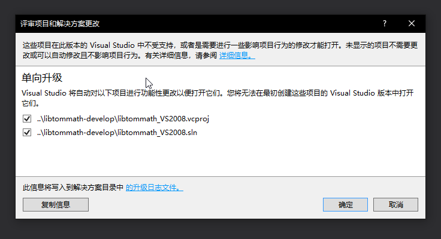
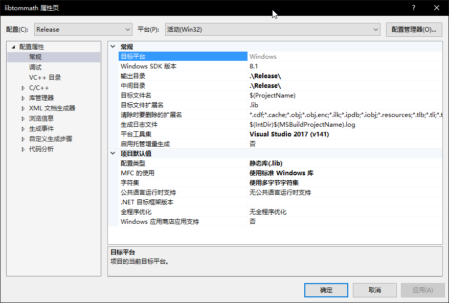
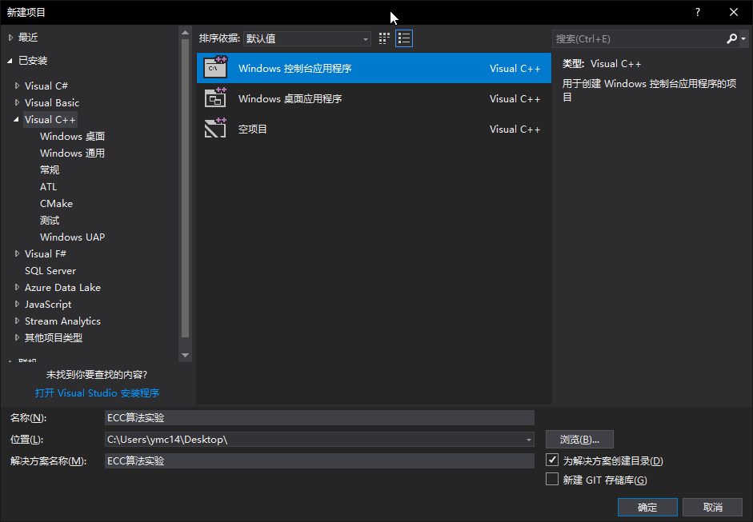

## ECC算法实验

### 【目的】
1. 可以调用开源的大整数库
2. 标注各函数功能

### 【环境】
- 操作机：windows xp

### 【工具】
- Microsoft Visial Studio 
- 任意C++ 编译器

### 【原理】
见课件中的ECC加密原理

### 【实验步骤】
#### 参考代码 C++

**ECC.cpp**
```c++

#include <stdio.h>
#include <string.h>
#include <stdlib.h>
#include <iostream>
#include "tommath.h"
#include <time.h>


#define BIT_LEN 800 
#define KEY_LONG 128  //私钥比特长
#define P_LONG 200    //有限域P比特长
#define EN_LONG 40    //一次取明文字节数(x,20)(y,20)

using namespace std;
//得到lon比特长素数
int GetPrime(mp_int *m,int lon);
//得到B和G点X坐标G点Y坐标
void Get_B_X_Y(mp_int *x1,mp_int *y1,mp_int *b,  mp_int *a,  mp_int *p);
//点乘
bool Ecc_points_mul(mp_int *qx,mp_int *qy, mp_int *px, mp_int *py,mp_int *d,mp_int *a,mp_int *p);
//点加
int Two_points_add(mp_int *x1,mp_int *y1,mp_int *x2,mp_int *y2,mp_int *x3,mp_int *y3,mp_int *a,bool zero,mp_int *p);
//二进制存储密文
int chmistore(mp_int *a,FILE *fp);
//把读取的字符存入mp_int型数
int putin(mp_int *a,char *ch,int chlong);
//ECC加密
void Ecc_encipher(mp_int *qx,mp_int *qy, mp_int *px, mp_int *py,mp_int *a,mp_int *p);
//ECC解密
void Ecc_decipher(mp_int *k, mp_int *a,mp_int *p);
//实现将mp_int数a中的比特串还原为字符串并赋给字符串ch：
int chdraw(mp_int *a,char *ch);
//取密文
int miwendraw(mp_int *a,char *ch,int chlong);


int myrng(unsigned char *dst, int len, void *dat)
{
   int x;
   for (x = 0; x < len; x++) dst[x] = rand() & 0xFF;
   return len;
}


void main(){

    cout<<"\n          本程序实现椭圆曲线的加密解密"<<endl;
    
    cout<<"\n------------------------------------------------------------------------\n"<<endl;
   
    mp_int GX;
    mp_int GY;
    mp_int K;//私有密钥
    mp_int A;
    mp_int B;
    mp_int QX;
    mp_int QY;
    mp_int P;//Fp中的p(有限域P)
    

    mp_init(&GX);
    mp_init(&GY);
    mp_init(&K);
    mp_init(&A);
    mp_init(&B);
    mp_init(&QX);
    mp_init(&QY);
    mp_init(&P);
    

    time_t t;           
    srand( (unsigned) time( &t ) );

    printf("椭圆曲线的参数如下(以十进制显示):\n");    

    GetPrime(&P,P_LONG);
    printf("有限域 P 是:\n");    
    char temp[800]={0};
    mp_toradix(&P,temp,10);
    printf("%s\n",temp);    

    GetPrime(&A,30);
    char tempA[800]={0};
    printf("曲线参数 A 是:\n");    
    mp_toradix(&A,tempA,10);
    printf("%s\n",tempA); 
    
    Get_B_X_Y(&GX,&GY,&B,&A,&P);

    char tempB[800]={0};
    printf("曲线参数 B 是:\n");    
    mp_toradix(&B,tempB,10);
    printf("%s\n",tempB); 
    
    char tempGX[800]={0};
    printf("曲线G点X坐标是:\n");    
    mp_toradix(&GX,tempGX,10);
    printf("%s\n",tempGX);   

    char tempGY[800]={0};
    printf("曲线G点Y坐标是:\n");
    mp_toradix(&GY,tempGY,10);
    printf("%s\n",tempGY); 
    

    //------------------------------------------------------------------
    GetPrime(&K,KEY_LONG);
    char tempK[800]={0};
    printf("私钥 K 是:\n");
    mp_toradix(&K,tempK,10);
    printf("%s\n",tempK); 

    Ecc_points_mul(&QX,&QY,&GX,&GY,&K,&A,&P);
    

    char tempQX[800]={0};
    printf("公钥X坐标是:\n");
    mp_toradix(&QX,tempQX,10);
    printf("%s\n",tempQX); 

    char tempQY[800]={0};
    printf("公钥Y坐标是:\n");
    mp_toradix(&QY,tempQY,10);
    printf("%s\n",tempQY); 


    printf("\n------------------------------------------------------------------------\n");

    Ecc_encipher(&QX,&QY,&GX,&GY,&A,&P);//加密

    printf("\n------------------------------------------------------------------------\n");

    Ecc_decipher(&K,&A,&P);//解密

    printf("\n------------------------------------------------------------------------\n");

    char cc;
    cout<<"\n\n请击一键退出!\n";
    cin>>cc;

    mp_clear(&GX);
    mp_clear(&GY);
    mp_clear(&K);//私有密钥
    mp_clear(&A);
    mp_clear(&B);
    mp_clear(&QX);
    mp_clear(&QY);
    mp_clear(&P);//Fp中的p(有限域P)
}


int GetPrime(mp_int *m,int lon){
   mp_prime_random_ex(m, 10, lon, 
        (rand()&1)?LTM_PRIME_2MSB_OFF:LTM_PRIME_2MSB_ON, myrng, NULL);
   return MP_OKAY;
}

void Get_B_X_Y(mp_int *x1,mp_int *y1,mp_int *b, mp_int *a, mp_int *p)
{
    mp_int tempx,tempy;
    mp_int temp;
    mp_int compare;
    mp_int temp1;
    mp_int temp2;
    mp_int temp3;
    mp_int temp4;
    mp_int temp5;
    mp_int temp6;
    mp_int temp7;
    mp_int temp8;
    
    mp_init_set_int (&compare, 0);
    mp_init(&tempx);
    mp_init(&tempy);
    mp_init(&temp);
    mp_init(&temp1);
    mp_init(&temp2);
    mp_init(&temp3);
    mp_init(&temp4);
    mp_init(&temp5);
    mp_init(&temp6);
    mp_init(&temp7);
    mp_init(&temp8);

 
   while(1)
   {
     
     //4a3+27b2≠0 (mod p)
     GetPrime(b,40);
     mp_expt_d(a, 3, &temp1);
     mp_sqr(b, &temp2);
     mp_mul_d(&temp1, 4, &temp3);
     mp_mul_d(&temp2, 27, &temp4);
     mp_add(&temp3, &temp4, &temp5);
     mp_mod(&temp5,p,&temp);

     if(mp_cmp(&temp, &compare)!=0 )
     {
         break;
     }
   }

   //y2=x3+ax+b,随机产生X坐标,根据X坐标计算Y坐标
   GetPrime(x1,30);
   mp_expt_d(x1, 3, &temp6);
   mp_mul(a, x1, &temp7);
   mp_add(&temp6, &temp7, &temp8);
   mp_add(&temp8, b, &tempx);
   mp_sqrt(&tempx, y1);


   mp_clear(&tempx);
   mp_clear(&tempy);
   mp_clear(&temp);
   mp_clear(&temp1);
   mp_clear(&temp2);
   mp_clear(&temp3);
   mp_clear(&temp4);
   mp_clear(&temp5);
   mp_clear(&temp6);
   mp_clear(&temp7);
   mp_clear(&temp8);


}

bool Ecc_points_mul(mp_int *qx,mp_int *qy, mp_int *px, mp_int *py,mp_int *d,mp_int *a,mp_int *p)
{
mp_int X1, Y1;
mp_int X2, Y2;
mp_int X3, Y3;
mp_int XX1, YY1;
mp_int A,P;

int i;
bool zero=false;
char Bt_array[800]={0};
char cm='1';

    mp_toradix(d,Bt_array,2); 

    mp_init_set_int(&X3, 0);
    mp_init_set_int(&Y3, 0);
    mp_init_copy(&X1, px);
    mp_init_copy(&X2, px);
    mp_init_copy(&XX1, px);
    mp_init_copy(&Y1, py);
    mp_init_copy(&Y2, py);
    mp_init_copy(&YY1, py);

    mp_init_copy(&A, a);
    mp_init_copy(&P, p);

    for(i=1;i<=KEY_LONG-1;i++)
    {
       mp_copy(&X2, &X1);
       mp_copy(&Y2, &Y1);
       Two_points_add(&X1,&Y1,&X2,&Y2,&X3,&Y3,&A,zero,&P);  
       mp_copy(&X3, &X2);
       mp_copy(&Y3, &Y2);
       if(Bt_array[i]==cm)
       {
          
           mp_copy(&XX1, &X1);
           mp_copy(&YY1, &Y1);
           Two_points_add(&X1,&Y1,&X2,&Y2,&X3,&Y3,&A,zero,&P);
           mp_copy(&X3, &X2);
           mp_copy(&Y3, &Y2);

       }

    }
        
   if(zero)
   {
       cout<<"It is Zero_Unit!";
       return false;//如果Q为零从新产生D
   }

   mp_copy(&X3, qx);
   mp_copy(&Y3, qy);

   mp_clear(&X1);
   mp_clear(&Y1);
   mp_clear(&X2);
   mp_clear(&Y2);
   mp_clear(&X3);
   mp_clear(&Y3);
   mp_clear(&XX1);
   mp_clear(&YY1);
   mp_clear(&A);
   mp_clear(&P);
  
   return true;
}

//两点加
int Two_points_add(mp_int *x1,mp_int *y1,mp_int *x2,mp_int *y2,mp_int *x3,mp_int *y3,mp_int *a,bool zero,mp_int *p)
{
mp_int x2x1;
mp_int y2y1;
mp_int tempk;
mp_int tempy;
mp_int tempzero;
mp_int k;
mp_int temp1;
mp_int temp2;
mp_int temp3;
mp_int temp4;
mp_int temp5;
mp_int temp6;
mp_int temp7;
mp_int temp8;
mp_int temp9;
mp_int temp10;


mp_init(&x2x1);
mp_init(&y2y1);
mp_init(&tempk);
mp_init(&tempy);
mp_init(&tempzero);
mp_init(&k);
mp_init(&temp1);
mp_init(&temp2);
mp_init_set(&temp3,2);
mp_init(&temp4);
mp_init(&temp5);
mp_init(&temp6);
mp_init(&temp7);
mp_init(&temp8);
mp_init(&temp9);
mp_init(&temp10);


   if(zero)
   {
      mp_copy(x1, x3);
      mp_copy(y1, y3);
      zero=false;
      goto L;
   }
   mp_zero(&tempzero);
   mp_sub(x2, x1, &x2x1);
   if(mp_cmp(&x2x1,&tempzero)==-1)
   {
      
      mp_add(&x2x1, p, &temp1);
      mp_zero(&x2x1);
      mp_copy(&temp1, &x2x1);
   }
   mp_sub(y2, y1, &y2y1);
   if(mp_cmp(&y2y1,&tempzero)==-1)
   {
     
      mp_add(&y2y1, p, &temp2);
      mp_zero(&y2y1);
      mp_copy(&temp2, &y2y1);
   }
   if(mp_cmp(&x2x1, &tempzero)!=0)
   {
       
       mp_invmod(&x2x1,p,&tempk);
       
       mp_mulmod(&y2y1, &tempk, p, &k);
   }
   else
   {
       if(mp_cmp(&y2y1, &tempzero)==0)
       {
          
          mp_mulmod(&temp3,y1,p,&tempy);
          mp_invmod(&tempy,p,&tempk);
          mp_sqr(x1, &temp4);     
          mp_mul_d(&temp4, 3, &temp5);
          mp_add(&temp5, a, &temp6);
          mp_mulmod(&temp6, &tempk, p, &k);
          
       }
       else
       {
          zero=true;
          goto L;
       }
   }  
 
   mp_sqr(&k, &temp7);
   mp_sub(&temp7, x1, &temp8);
   mp_submod(&temp8, x2, p, x3);
 
   mp_sub(x1, x3, &temp9);
   mp_mul(&temp9, &k, &temp10);
   mp_submod(&temp10, y1, p, y3);


L:

   mp_clear(&x2x1);
   mp_clear(&y2y1);
   mp_clear(&tempk);
   mp_clear(&tempy);
   mp_clear(&tempzero);
   mp_clear(&k);
   mp_clear(&temp1);
   mp_clear(&temp2);
   mp_clear(&temp3);
   mp_clear(&temp4);
   mp_clear(&temp5);
   mp_clear(&temp6);
   mp_clear(&temp7);
   mp_clear(&temp8);
   mp_clear(&temp9);
   mp_clear(&temp10);

   return 1;

}

//二进制存储密文
int chmistore(mp_int *a,FILE *fp)
{

   int i,j;
   char ch;
   char chtem[4];

   mp_digit yy=(mp_digit)255;
   for (i=0; i <= a->used - 1;  i++) { 

      chtem[3]=(char)(a->dp[i] & yy);     
      chtem[2]=(char)((a->dp[i] >> (mp_digit)8) & yy);        
      chtem[1]=(char)((a->dp[i] >> (mp_digit)16) & yy);    
      chtem[0]=(char)((a->dp[i] >> (mp_digit)24) & yy);

      for(j=0;j<4;j++)
      {
          fprintf(fp,"%c",chtem[j]);
      }
      
  }  

  ch=char(255);
  fprintf(fp, "%c", ch);
  return MP_OKAY;
}


//把读取的字符存入mp_int型数
int putin(mp_int *a,char *ch,int chlong)
{
    mp_digit *temp,yy;
    int i,j,res;
    if(a->alloc<chlong*2/7+2)
    {
        if((res=mp_grow(a,chlong*2/7+2))!=MP_OKAY)
            return res;
    }
    
    a->sign=0;
    mp_zero(a);
    temp=a->dp;
    i=0;
    yy=(mp_digit)15;

    if(chlong<4)
    {
            for(j=chlong-1;j>=0;j--)
            {
               *temp |= (mp_digit)(ch[j] & 255);
               *temp <<= (mp_digit)CHAR_BIT;
            }
            *temp >>= (mp_digit)8;
            a->used=1;
            return MP_OKAY;
    }

    if(chlong<7)
    {
            i+=4;
            *++temp |= (mp_digit)(ch[i-1] & yy);
            *temp <<= (mp_digit)CHAR_BIT;
            *temp |= (mp_digit)(ch[i-2] & 255);
            *temp <<= (mp_digit)CHAR_BIT;
            *temp |= (mp_digit)(ch[i-3] & 255);
            *temp <<= (mp_digit)CHAR_BIT;
            *temp-- |= (mp_digit)(ch[i-4] & 255); //存放被切分的字符的低四位

            
            for(j=chlong-1;j>=i;j--)
            {  
               *temp |= (mp_digit)(ch[j] & 255);
               *temp <<= (mp_digit)CHAR_BIT;                            
            }
            *temp >>= (mp_digit)4;
            *temp |= (mp_digit)((ch[i-1] & 255) >> 4);  //存放被切分的字符的高四位
            
            a->used=2;
            return MP_OKAY;
    }

        //以7个字符为单元循环，把七个字符放入的mp_int 的两个单元中
    for(j=0;j<chlong/7;j++)
    {
        i+=7;
        *++temp |= (mp_digit)(ch[i-1] & 255);
        *temp <<= (mp_digit)CHAR_BIT;
        *temp |= (mp_digit)(ch[i-2] & 255);
        *temp <<= (mp_digit)CHAR_BIT;
        *temp |= (mp_digit)(ch[i-3] & 255);
        *temp <<= (mp_digit)4;
        *temp-- |= (mp_digit)((ch[i-4] & 255) >> 4);    //存放被切分的字符的高四位

        *temp |= (mp_digit)(ch[i-4] & yy);      //存放被切分的字符的低四位
        *temp <<= (mp_digit)CHAR_BIT;
        *temp |= (mp_digit)(ch[i-5] & 255);
        *temp <<= (mp_digit)CHAR_BIT;
        *temp |= (mp_digit)(ch[i-6] & 255);
        *temp <<= (mp_digit)CHAR_BIT;
        *temp++ |= (mp_digit)(ch[i-7] & 255); 

        temp++;
    
    }
 
    if((chlong>=7)&&(chlong%7!=0))        //剩余字符的存放
    {
        if(chlong%7 < 4)           //剩余字符少余4个时，只需一个mp_digit单元存放
        {
            for(j=chlong-1;j>=i;j--)
            {
               *temp |= (mp_digit)(ch[j] & 255);
               *temp <<= (mp_digit)CHAR_BIT;
            }
            *temp >>= (mp_digit)8;
            a->used=chlong*2/7+1;
        }
        else
        {                       //剩余字符不小于4个时，需两个mp_digit单元存放
            i+=4;
            *temp |= (mp_digit)(ch[i-1] & yy);
            *temp <<= (mp_digit)CHAR_BIT;
            *temp |= (mp_digit)(ch[i-2] & 255);
            *temp <<= (mp_digit)CHAR_BIT;
            *temp |= (mp_digit)(ch[i-3] & 255);
            *temp <<= (mp_digit)CHAR_BIT;
            *temp++ |= (mp_digit)(ch[i-4] & 255); //存放被切分的字符的低四位

            
            for(j=chlong-1;j>=i;j--)
            {  
               *temp |= (mp_digit)(ch[j] & 255);
               *temp <<= (mp_digit)CHAR_BIT;                            
            }
            *temp >>= (mp_digit)4;
            *temp |= (mp_digit)((ch[i-1] & 255) >> 4);  //存放被切分的字符的高四位
            
            a->used=chlong*2/7+2;
        }

    }
    else
    {
       a->used=chlong*2/7;
    }
    return MP_OKAY;
}


void Ecc_encipher(mp_int *qx,mp_int *qy, mp_int *px, mp_int *py,mp_int *a,mp_int *p){  //公钥X、Y坐标，曲线G点X、Y坐标，曲线参数A，有限域P

    mp_int mx, my;
    mp_int c1x, c1y;
    mp_int c2x, c2y;
    mp_int r;
    mp_int tempx, tempy;
    bool zero=false;
    FILE *fp,*fq;
    int i;
    char miwenx[280]={0};
    char miweny[280]={0};
    char stemp[650]={0};


    mp_init(&mx);
    mp_init(&my);
    mp_init(&c1x);
    mp_init(&c1y);
    mp_init(&c2x);
    mp_init(&c2y);
    mp_init(&r);
    mp_init(&tempx);
    mp_init(&tempy);

    GetPrime(&r, 100);

    char filehead[60],filefoot[20],filename[85]={0};
    cout<<"请输入您要加密文件的存放路径和文件名(如:  c:\\000\\大整数运算  ):"<<endl;
    cin>>filehead;
    cout<<"请输入您要加密文件的扩展名(如:  .doc  ):"<<endl;
    cin>>filefoot;
    strcpy(filename,filehead);
    strcat(filename,filefoot);
    

//打开要加密文件
    if((fp=fopen(filename,"rb"))==NULL)
    {
        printf("can not open the file!");
        exit(1);
    }

    unsigned int FileLong=0;//文件字符长度
    char ChTem;//临时字符变
    int Frequency=0;
    int Residue=0;

    while( !feof(fp) )//找文件字符长度
    {
        ChTem = fgetc( fp );
        FileLong++;
    }
    --FileLong;


    Frequency = FileLong/EN_LONG;
    Residue = FileLong%EN_LONG;

    int enlongtemp=EN_LONG/2;
    //printf("%d\n",Frequency);  
    //printf("%d\n",Residue);  

    char filemi[85];
    strcpy(filemi,filehead);
    strcat(filemi,"密文");
    strcat(filemi,filefoot);
    

 //打开保存密文文件
    if((fq=fopen(filemi,"wb"))==NULL)
    {
         printf("can not open the file!\n");
         exit(1);
    }

    printf("\n开始加密...\n");


    rewind(fp);
    for(i=0; i<Frequency; i++)
    {   
  
        fread(miwenx,1,enlongtemp,fp);//读入字符串
        miwenx[enlongtemp]=char(255);

        fread(miweny,1,enlongtemp,fp);//读入字符串
        miweny[enlongtemp]=char(255);

        putin(&mx, miwenx,enlongtemp+1);//文件存入         
        putin(&my, miweny,enlongtemp+1);//文件存入

        Ecc_points_mul(&c2x,&c2y,px,py,&r,a,p);//加密
        Ecc_points_mul(&tempx,&tempy,qx,qy,&r,a,p); 
        Two_points_add(&mx,&my,&tempx,&tempy,&c1x,&c1y,a,zero,p);

        //保存密文      
        chmistore(&c1x,fq); 
        chmistore(&c1y,fq);
        chmistore(&c2x,fq);
        chmistore(&c2y,fq);

    }
    //剩余字符处理
    if ( Residue > 0)
    {
         if (Residue <= enlongtemp ) 
        {
            fread(miwenx,1,Residue,fp);//读入字符串
            miwenx[Residue]=char(255);
     
            putin(&mx, miwenx,Residue+1);//文件存入 

            mp_zero(&my);
        
        }
        else
        {

            fread(miwenx,1,enlongtemp,fp);//读入字符串
            miwenx[enlongtemp]=char(255);
        

            fread(miweny,1,Residue-enlongtemp,fp);//读入字符串
            miweny[Residue-enlongtemp]=char(255);

             putin(&mx, miwenx,enlongtemp+1);//文件存入 

            putin(&my, miweny,Residue-enlongtemp+1);//文件存入 
        }

        Ecc_points_mul(&c2x,&c2y,px,py,&r,a,p);//加密

        Ecc_points_mul(&tempx,&tempy,qx,qy,&r,a,p); 

        
        Two_points_add(&mx,&my,&tempx,&tempy,&c1x,&c1y,a,zero,p);

     
        //保存密文      
        chmistore(&c1x,fq); 

        chmistore(&c1y,fq);

        chmistore(&c2x,fq);

        chmistore(&c2y,fq);  
    }

    
        cout<<"\nok!加密完毕!"<<endl;
        cout<<"密文以二进制保存"<<endl;
        cout<<"密文存放路径为  "<<filemi<<endl ;


        fclose(fq);
        fclose(fp);
        mp_clear(&mx);
        mp_clear(&my);
        mp_clear(&c1x);
        mp_clear(&c1y);
        mp_clear(&c2x);
        mp_clear(&c2y);
        mp_clear(&r);
        mp_clear(&tempx);
        mp_clear(&tempy);
     

}

//取密文

int miwendraw(mp_int *a,char *ch,int chlong)
{
    mp_digit *temp;
    int i,j,res;

    if(a->alloc<chlong/4)
    {
        if((res=mp_grow(a,chlong/4))!=MP_OKAY)
            return res;
    }

    a->alloc=chlong/4;
    a->sign=0;
    mp_zero(a);
    temp=a->dp;
    i=0;

    for(j=0;j<chlong/4;j++)
    {
        i+=4;
        *temp |= (mp_digit)(ch[i-4] & 255);
        *temp <<= (mp_digit)CHAR_BIT;
        *temp |= (mp_digit)(ch[i-3] & 255);
        *temp <<= (mp_digit)CHAR_BIT;
        *temp |= (mp_digit)(ch[i-2] & 255);
        *temp <<= (mp_digit)CHAR_BIT;
        *temp++ |= (mp_digit)(ch[i-1] & 255); 
    }
    a->used=chlong/4;
    return MP_OKAY;
}

//实现将mp_int数a中的比特串还原为字符串并赋给字符串ch：
int chdraw(mp_int *a,char *ch)
{
    int i,j;
    mp_digit *temp,xx,yy;

    temp=a->dp;
    i=0;
    yy=(mp_digit)255;  //用于位与运算，取八位比特串
    xx=(mp_digit)15;  //用于位与运算，取四位比特串

    for(j=0;j<a->used/2;j++)  //以两个单元为循环，把两个单元的比特串赋给7个字符
    {
        i+=7;
        ch[i-4]=(char)(*++temp & xx);
        ch[i-3]=(char)((*temp >> (mp_digit)4) & yy);    
        ch[i-2]=(char)((*temp >> (mp_digit)12) & yy);
        ch[i-1]=(char)((*temp-- >> (mp_digit)20) & yy);

        ch[i-7]=(char)(*temp & yy);
        ch[i-6]=(char)((*temp >> (mp_digit)8) & yy);
        ch[i-5]=(char)((*temp >> (mp_digit)16) & yy);
        ch[i-4] <<= 4;
        ch[i-4]+=(char)((*temp++ >> (mp_digit)24) & xx);
        temp++;
    }
    if(a->used%2!=0)  //剩于一个单元的处理
    {
        ch[i++] = (char)(*temp & yy);
        ch[i++] = (char)((*temp >> (mp_digit)8) & yy);
        ch[i++] = (char)((*temp >> (mp_digit)16) & yy);
    }
    --i;
    while(int(ch[i]&0xFF) != 255 && i>0) i--;
    return i;
   
}

void Ecc_decipher(mp_int *k, mp_int *a,mp_int *p){

    mp_int c1x, c1y;
    mp_int c2x, c2y;
    mp_int tempx, tempy;
    mp_int mx, my;
    mp_int temp;

    mp_init(&temp);
    mp_init(&c1x);
    mp_init(&c1y);
    mp_init(&c2x);
    mp_init(&c2y);
    mp_init(&tempx);
    mp_init(&tempy);
    mp_init(&mx);
    mp_init(&my);

    mp_int tempzero;
    mp_init(&tempzero);

    int i;
    char stemp[700]={0};
    FILE *fp,*fq;
    bool zero=false;


    char filehead[60],filefoot[20],filename[85]={0};
    cout<<"请输入您要解密的文件的存放路径和文件名(如:  c:\\000\\大整数运算  ):"<<endl;
    cin>>filehead;
    cout<<"请输入您要解密的文件的扩展名(如:  .doc  ):"<<endl;
    cin>>filefoot;
    strcpy(filename,filehead);
    strcat(filename,filefoot);

    printf("\n开始解密\n");

    if((fp=fopen(filename,"rb"))==NULL)
    {
         printf("can not open the file!");
         exit(1);
    }
 
   //打开保存解密结果文件
    char filemi[80];
    strcpy(filemi, filehead);
    strcat(filemi, "解密");
    strcat(filemi, filefoot);

    if((fq=fopen(filemi,"wb"))==NULL)
    {
         printf("can not open the file!");
         exit(1);
    }


    rewind(fp);
    while(!feof(fp))
    {
         i=0;
         while(1)
        {
             stemp[i]=fgetc(fp);
             if(i%4==0)
            {
                 if(int(stemp[i]&0xFF) == 255 ) goto L1;
            }
            i++;
        }
             
L1:     miwendraw(&c1x, stemp, i);
         i=0;
         while(1)
        {
             stemp[i]=fgetc(fp);
             if(i%4==0)
            {
                 if(int(stemp[i]&0xFF) == 255 ) goto L2;
            }
            i++;
        }
             
L2:     miwendraw(&c1y, stemp, i);
         i=0;
         while(1)
        {
             stemp[i]=fgetc(fp);
             if(i%4==0)
            {
                 if(int(stemp[i]&0xFF) == 255 ) goto L3;
            }
            i++;
        }
             
L3:     miwendraw(&c2x, stemp, i);
                i=0;
         while(1)
        {
             stemp[i]=fgetc(fp);
             if(i%4==0)
            {
                 if(int(stemp[i]&0xFF) == 255 ) goto L4;
            }
            i++;
        }
             
L4:     miwendraw(&c2y, stemp, i);

        mp_zero(&tempzero);
        if(mp_cmp(&c1x, &tempzero)==0) break;

        Ecc_points_mul(&tempx, &tempy, &c2x, &c2y, k, a, p); 

        mp_neg(&tempy, &temp);
        Two_points_add(&c1x,&c1y,&tempx,&temp,&mx,&my,a,zero,p);
        
        int chtem;
        chtem=chdraw(&mx,stemp);//从ming中取出字符串
     

        //保存解密结果
    
        for(int kk=0;kk<chtem;kk++)
        {
             fprintf(fq,"%c",stemp[kk]);
                   
        }

        chtem=chdraw(&my,stemp);//从ming中取出字符串
    
             
         //保存解密结果
          for(kk=0;kk<chtem;kk++)
        {
              fprintf(fq,"%c",stemp[kk]);
            
        }
          
        
    }

       cout<<"\nok!解密完毕!"<<endl;
    cout<<"解密后的文字存放路径为  "<<filemi<<endl;

    fclose(fq);
    fclose(fp);
    mp_clear(&c1x);
    mp_clear(&c1y);
    mp_clear(&c2x);
    mp_clear(&c2y);
    mp_clear(&tempx);
    mp_clear(&tempy);
    mp_clear(&mx);
    mp_clear(&my);
    mp_clear(&temp);


}
```
1. 使用tommath作为一个大整数库来使用

相对于自己编写一个大整数函数，开源的大整数库算法效率高，准确性更有保障。
LibTomMath是一个免费的开源便携式数字理论多精度整数库，用C语言编写。该库旨在为使用API​​提供简单的工作，提供相当高效的例程，无需配置即可使用。
网上有很多开源的大整数库可供使用，同学们可以自由发挥。

2. 从官网下载tommath源码，并编译为`.lib`文件
- 地址 https://github.com/libtom/libtommath

- 解压下载的zip包
- 使用visual studio打开文件中的`libtommath_VS2008.sln`
如果vs版本高于vs2008时，需要修改一些兼容性设置。

点击`确定`。
- 点击属性，对项目进行修改

**修改前：**

**修改后：**

- 生成`.lib`文件

生成后的`tommath.lib`文件在`\Release`目录下

3. 新建项目“ECC算法实验”

