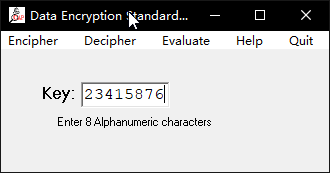

## 在CAP4软件中实现DES加密法

### 【目的】
掌握DES的加密方法
### 【环境】
本地运行
### 【工具】
CAP4
### 【原理】
DES加密法
### 【实验步骤】
**1. 将需要加密的密文复制到CAP的plaintext中**
> Do you like cryptology

**2. 使用Ciphers中的DES功能**

**3. 输入8位任意数值，点击Encipher**

**4. 得到加密后的密文**

