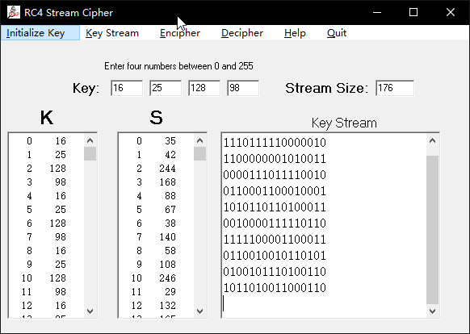

## 在CAP4软件中实现RC4加密
###【目的】
了解RC4加密的原理
### 【环境】
本地运行
### 【工具】
CAP4
### 【原理】
RC4
### 【实验步骤】
**1. 复制明文信息到plaintext中**

>Do you like cryptology

**2. 选择Ciphers中的RC4功能**
输入初始的变量值，一共4个，在0到255以内即可，点击initialize Key生成“s”盒。

**3. 点击Encipher进行加密**
此时程序生成了对应的加密序列，以及对应的密文

